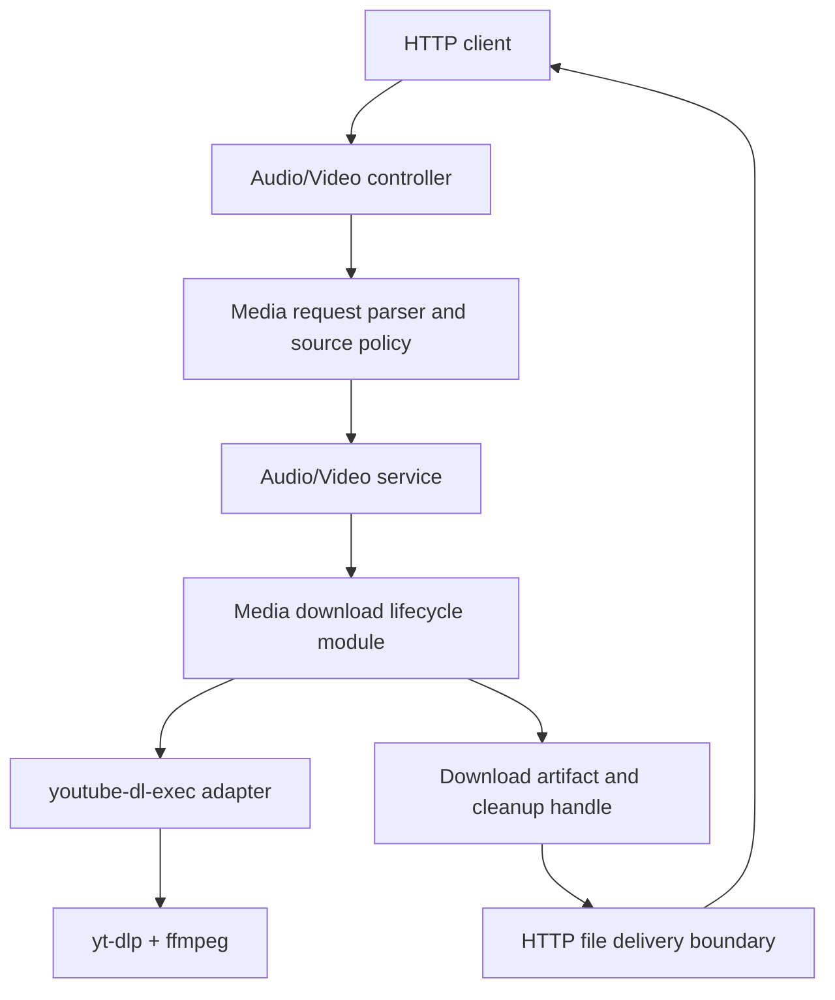

# Media Download Architecture Refactor Plan

## Summary

Media Nest의 audio/video 다운로드 흐름을 얕은 중복 서비스에서 검증된 요청 객체, 공통 다운로드 lifecycle, `youtube-dl-exec` adapter, HTTP delivery boundary로 나눈다. 리팩터 전에는 현재 API 계약과 실패 경로를 characterization test로 고정하고, 실행 단계에서는 서브에이전트를 테스트/보안/백엔드/문서 검증 단위로 분리해 관리한다.

---

## Problem Frame

현재 `src/audio/audio.service.ts`와 `src/video/video.service.ts`는 입력 정규화, 임시 디렉터리 생성, `youtube-dl-exec` 실행, 이벤트 처리, Express 응답 전송, cleanup을 거의 같은 방식으로 반복한다. 이 구조는 기능이 작을 때는 동작하지만, 다운로드 실패 처리나 cleanup 정책을 바꾸려면 두 도메인 서비스를 동시에 수정해야 한다.

추가로 현재 문서는 YouTube URL 또는 YouTube 영상 ID 중심 제품 범위를 설명하지만, 코드의 URL 검증은 `http/https`만 확인한다. 공개 API로 운영될 경우 SSRF 성격의 외부 요청 악용, 장시간 다운로드 작업 누적, 내부 경로/상위 오류 메시지 노출이 리팩터 설계에 영향을 준다.

---

## Requirements

- R1. 기존 HTTP API 경로인 `GET /audio`, `GET /audio/:id`, `GET /video`, `GET /video/:id`, `GET /health`를 유지한다.
- R2. 오디오/비디오의 현재 정상 응답 계약인 `Content-Type`, `Content-Disposition`, `.mp3`/`.mp4` 확장자, 기본 format 선택을 characterization test로 먼저 고정한다.
- R3. URL, YouTube ID, 파일명, bitrate, resolution 검증을 request parsing seam으로 모아 서비스 caller가 검증 순서를 직접 조합하지 않게 한다.
- R4. audio/video 서비스의 공통 다운로드 lifecycle을 deep module로 묶고, 포맷별 차이는 작은 adapter 또는 option builder로 남긴다.
- R5. `youtube-dl-exec`, ffmpeg 위치, child process 이벤트 규약을 infra adapter 뒤로 격리한다.
- R6. 서비스 경계에서 Express `Response` 의존성을 줄이고, HTTP 파일 전송과 cleanup ownership을 명확히 한다.
- R7. source policy를 중앙화하되, non-YouTube URL 차단처럼 기존 클라이언트 동작을 바꿀 수 있는 변경은 별도 decision gate를 거친다.
- R8. client-facing 에러와 로그가 임시 경로, upstream stderr, credential 포함 URL을 노출하지 않게 공통 redaction 정책을 둔다.
- R9. 장시간 다운로드 작업에 대한 timeout, concurrency cap, client abort cleanup 같은 실행 보호장치는 구조 seam을 먼저 만들고, 활성화 여부는 별도 decision gate를 거친다.
- R10. Docker/runtime pinning과 compose 운영 흐름은 기존 계획과 문서를 존중하고, 이번 작업은 애플리케이션 구조 리팩터에 집중한다.
- R11. 리팩터 실행은 서브에이전트별 write set과 검증 gate를 분리해 충돌을 줄인다.

---

## Scope Boundaries

- 웹 UI, 사용자 계정, 인증, 권한 관리, 다운로드 이력, 영구 저장, CDN 제공은 포함하지 않는다.
- `youtube-dl-exec`를 다른 미디어 다운로드 라이브러리로 교체하지 않는다.
- Docker base image, compose 운영 명령, 기존 runtime pinning 전략을 주 리팩터 범위로 다시 열지 않는다.
- 상세한 public error code 체계 전체를 새로 설계하지 않는다. 이번 범위는 안전한 generic client message와 내부 로그 redaction까지다.
- Chrome 확장 프로그램 origin 검증과 CORS allowlist 강제는 기존 문서의 보류 결정을 유지한다.

### Deferred to Follow-Up Work

- 인증 또는 signed request 도입: 공개 운영 방식이 확정된 뒤 별도 보안/제품 계획으로 다룬다.
- reverse proxy rate limit과 IP 기반 정책: 배포 환경의 nginx/Cloudflare 구성이 확정된 뒤 운영 계획으로 분리한다.
- `yt-dlp` checksum/signature 검증 또는 internal artifact registry: supply-chain hardening 계획으로 분리한다.
- readiness endpoint 확장: ffmpeg, `yt-dlp`, temp directory writability를 `/health`와 분리해 검사하는 운영 개선으로 분리한다.

---

## Context & Research

### Relevant Code and Patterns

- `src/media/media-request.util.ts`: 현재 입력 검증, 임시 작업 디렉터리, 다운로드 실패 응답 helper가 한 파일에 모여 있다.
- `src/audio/audio.service.ts`, `src/video/video.service.ts`: 다운로드 lifecycle과 Express 응답 전송이 중복 구현되어 있다.
- `src/audio/dto/get-audio.dto.ts`, `src/video/dto/get-video.dto.ts`: DTO가 runtime validation을 수행하지 않는 type alias다.
- `src/main.ts`: `app.enableCors()` 전체 허용과 `.env.{NODE_ENV}` 로드 흐름의 진입점이다.
- `src/audio/audio.service.spec.ts`, `src/video/video.service.spec.ts`: 현재는 각 서비스의 성공 경로 1개와 일부 입력 거절만 고정한다.
- `test/app.e2e-spec.ts`: `/health`와 일부 400 응답만 확인한다.
- `docs/api/current-implementation-prd.md`, `docs/api/current-implementation-fsd.md`: YouTube URL/ID 중심 API와 현재 제외 범위를 정의한다.
- `docs/plans/2026-06-18-001-refactor-runtime-dependency-pinning-plan.md`: runtime pinning은 이미 별도 완료 계획으로 다뤘다.
- `docs/plans/2026-06-18-002-docker-compose-operations-plan.md`: compose 운영 절차는 별도 계획으로 다뤘다.

### Subagent Findings

- `code-mapper`: 현재 요청 흐름은 `controller -> service -> media-request.util -> youtube-dl-exec -> response.sendFile` 구조이며, 주요 seam은 입력 검증, 외부 프로세스 실행, Express 응답 전송이다.
- `architect-reviewer`: 우선순위가 높은 리팩터 후보는 공통 다운로드 lifecycle deep module, 서비스에서 `Response` 제거, request object seam, `youtube-dl-exec` infra adapter다. `npm test -- --runInBand`는 5개 suite, 9개 test 통과로 보고되었다.
- `qa-expert`: `npm test`, `npm run test:e2e`, `npm run test:cov`, `npm run build`, `npm run lint`, `npm run verify:runtime`, `docker compose config`가 통과했다. Coverage는 statements 약 58%, branches 약 46%이며, 리팩터 전 `media-request.util`과 downloader 실패 경로 characterization이 필요하다.
- `security-auditor`: non-YouTube URL 허용, 작업 제한 부재, 에러/로그 노출, `yt-dlp` supply chain 검증 약화가 계획에 반영되어야 한다. shell injection보다는 source policy와 실행 제한이 더 큰 리스크로 판단되었다.

### External References

- OWASP SSRF Prevention Cheat Sheet: user-supplied URL을 가져오는 서버 기능은 allowlist, redirect/DNS 재검증, raw response 노출 방지 같은 방어가 필요하다.
- OWASP Top 10 2021 A10 SSRF: application layer에서 schema/port/destination positive allowlist, raw response 차단, redirect 주의가 권고된다.
- NestJS Pipes and Validation docs: request validation/transform은 pipe 또는 `ValidationPipe`/DTO seam으로 모을 수 있다.
- Express 4.x API docs: `Response`는 HTTP transport boundary이므로 서비스 core와 섞이면 테스트와 재사용성이 떨어진다.

---

## Key Technical Decisions

- Characterization-first로 진행한다: 현재 테스트가 얕기 때문에 구조 변경 전에 유틸 검증, downloader 이벤트 순서, sendFile 실패, cleanup을 먼저 고정한다.
- 공통화 범위는 "다운로드 lifecycle"까지로 제한한다: audio/video의 format, extension, MIME, `yt-dlp` 옵션 차이는 adapter에 남겨 과도한 일반화를 피한다.
- source policy는 request parsing seam에 둔다: 서비스가 임의 URL 문자열을 직접 받지 않고, 검증된 media source를 받도록 만든다.
- source policy는 먼저 중앙화하고 현재 동작은 보존한다: non-YouTube URL 차단은 보안상 권장되지만 제품-visible 변경이므로 U2 이후 decision gate에서 승인된 경우에만 활성화한다.
- Express `Response` 분리는 cleanup ownership과 함께 설계한다: 파일 전송 완료 후 임시 디렉터리 삭제가 흐려지면 리팩터가 오히려 위험해진다.
- security hardening은 두 층으로 나눈다: redacted error/log와 cleanup 안정성은 구조 리팩터의 기본 범위이고, timeout/concurrency rejection과 strict allowlist는 decision gate 이후 적용한다.
- Docker/runtime 변경은 최소화한다: 기존 두 계획이 운영 경계를 이미 다루므로, 이번 계획은 앱 구조와 테스트 surface를 중심으로 한다.

---

## Open Questions

### Resolved During Planning

- URL API를 계속 유지할 것인가: 유지한다. 다만 입력 정책을 한 seam에 모아 YouTube URL 중심으로 좁힐 수 있게 만든다.
- 리팩터를 한 번에 처리할 것인가: 아니다. 테스트 고정, request seam, downloader adapter, lifecycle module, HTTP boundary 순서로 나눈다.
- 서브에이전트는 언제 쓰는가: read-only 분석은 병렬, 코드 변경은 write set이 겹치지 않을 때만 병렬로 쓴다.

### Decision Gates

- DG1. U2 완료 후 source policy 선택: 현재 `http/https` URL 허용을 유지할지, YouTube allowlist로 좁힐지 결정한다. 구조 리팩터만 진행하는 기본값은 기존 동작 보존이다.
- DG2. U6 시작 전 실행 제한 선택: timeout/concurrency cap을 실제 HTTP rejection으로 활성화할지, lifecycle 내부 cancel/cleanup hook까지만 둘지 결정한다.

### Deferred to Implementation

- non-YouTube URL을 실제로 차단할 때의 exact status/message: DG1에서 allowlist가 승인되면 구현 시 현재 클라이언트 영향과 e2e test를 보며 결정한다.
- timeout/concurrency cap의 기본값: DG2에서 활성화가 승인되면 운영 환경과 예상 요청량을 확인한 뒤 env 기본값과 문서 값을 정한다.
- request parsing을 Nest pipe로 둘지 plain factory/value object로 둘지: U2 구현 중 기존 테스트와 파일 수 부담을 비교해 결정한다.
- HTTP delivery boundary의 최종 이름과 파일 배치: cleanup ownership이 선명한 쪽을 구현 중 선택한다.

---

## High-Level Technical Design

> *This illustrates the intended approach and is directional guidance for review, not implementation specification. The implementing agent should treat it as context, not code to reproduce.*

The lifecycle module owns process execution state, timeout/concurrency/abort cleanup, and normalized failure categories. The delivery boundary owns HTTP headers, file transfer, and post-send cleanup. Audio/video services should mostly choose media kind, format constraints, and source input.

---

## Subagent Operating Model

- **Coordinator:** main agent owns plan order, conflict review, final integration, and full verification. It does not let workers edit overlapping files in parallel.
- **QA agent:** owns U1 test expansion and later regression matrix review. Preferred role: `qa-expert` or `test-automator`.
- **Security agent:** owns U2/U6 threat review, source-policy edge cases, and redaction expectations. Preferred role: `security-auditor`.
- **Backend refactor agent:** owns U3/U4 structural extraction. Preferred role: `refactoring-specialist` or `backend-developer`.
- **Transport/docs agent:** owns U5/U7 HTTP delivery, docs, and operational notes when write sets do not overlap with backend extraction. Preferred role: `documentation-engineer` for docs-only work.
- **Reviewer agents:** after U4 and after U6, run `code-reviewer` plus `qa-expert`/`security-auditor` read-only passes before merge.

Parallelization rule: U1 tests and docs-only review can run in parallel with read-only audits. U2 through U6 should mostly run sequentially because they touch the same `src/media`, `src/audio`, and `src/video` seams.

### Handoff Gates

- After U1: coordinator freezes the observed API contract and records any intentional deviations before U2 starts.
- After U2: coordinator runs DG1, then freezes the media request object shape and source-policy mode before U3 starts.
- After U3: backend/refactor worker hands off a downloader port with deterministic test doubles so U4-U6 do not call the network in tests.
- After U4: code-reviewer performs a read-only architecture pass focused on over-abstraction, cleanup ownership, and duplicate event handling.
- After U5: coordinator confirms HTTP delivery tests cover send success, send failure, and cleanup without relying on real downloads.
- Before U6: coordinator runs DG2 and freezes whether timeout/concurrency rejection is active behavior or only prepared infrastructure.
- After U6: security-auditor and QA reviewer run read-only passes before U7 updates docs.

### Test Harness Notes

- U3 should introduce a provider override path for the downloader port in tests. HTTP/e2e scenarios after U3 should use deterministic fake downloader behavior instead of real network downloads.
- `sendFile` callback failure belongs in HTTP delivery unit tests, where Express `Response` can be mocked directly.
- timeout, concurrency, and abort behavior belong in lifecycle/adapter tests first. Only representative HTTP-level mappings should be added to `test/app.e2e-spec.ts`.
- `npm run test:cov` is a review signal, not a hard percentage gate. It should run at U1 and final verification so coverage regressions are visible.

---

## Implementation Units

### U1. Add Characterization Safety Net

**Goal:** 현재 동작을 고정해 이후 구조 변경이 API 계약, 입력 검증, 실패 처리, cleanup을 깨뜨리지 않게 한다.

**Requirements:** R1, R2, R11

**Dependencies:** None

**Files:**
- Create: `src/media/media-request.util.spec.ts`
- Modify: `src/audio/audio.service.spec.ts`
- Modify: `src/video/video.service.spec.ts`
- Modify: `src/audio/audio.controller.spec.ts`
- Modify: `src/video/video.controller.spec.ts`
- Modify: `src/health/health.controller.spec.ts`
- Modify: `test/app.e2e-spec.ts`

**Approach:**
- `media-request.util`의 filename, positive integer, source URL, YouTube ID, download failure helper를 직접 테스트한다.
- audio/video service spec에 default format, explicit format, downloader `error`, non-zero `close`, `sendFile` callback error, duplicate event ordering을 추가한다.
- controller spec은 "정의됨"을 넘어 service delegation 계약을 확인한다.
- e2e는 invalid URL, invalid ID, invalid filename, invalid bitrate/resolution의 대표 matrix를 추가한다.

**Execution note:** Characterization-first. 이 유닛은 리팩터 전 빨간 테스트를 만들 목적이 아니라 현재 계약을 보존하기 위한 safety net이다.

**Patterns to follow:**
- 현재 `src/audio/audio.service.spec.ts`와 `src/video/video.service.spec.ts`의 `EventEmitter` 기반 `youtube-dl-exec` mock.
- 현재 `test/app.e2e-spec.ts`의 Supertest 기반 Nest application setup.

**Test scenarios:**
- Happy path: explicit audio bitrate가 `bestaudio[abr<=320]/best` format과 `.mp3` 응답명을 만든다.
- Happy path: explicit video resolution이 `bestvideo[height<=720]+bestaudio/best` format과 `.mp4` 응답명을 만든다.
- Edge case: `filename`이 trim되며 `.`, `..`, path separator, control character는 거절된다.
- Edge case: `resolution`/`bitrate`의 `undefined`와 빈 문자열은 optional로 처리되고, `0`, 음수, 소수, NaN 문자열은 거절된다.
- Error path: downloader `error`는 cleanup 후 generic 500 응답으로 이어진다.
- Error path: `close` code가 0이 아니면 cleanup 후 generic 500 응답으로 이어진다.
- Error path: `sendFile` callback error에서도 cleanup이 수행되고 이중 응답이 발생하지 않는다.
- Integration: `/health`는 계속 `{ ok: true }`를 반환한다.

**Verification:**
- 기존 테스트에 더해 새 characterization test가 통과하고, coverage에서 `src/media/media-request.util.ts`와 audio/video 실패 분기가 의미 있게 올라간다.

---

### U2. Centralize Media Request Contract and Source Policy

**Goal:** 서비스가 raw query/path 조합을 직접 검증하지 않고, 검증된 media request object를 받도록 만든다.

**Requirements:** R3, R7, R8

**Dependencies:** U1

**Files:**
- Create: `src/media/media-source-policy.ts`
- Create: `src/media/media-request.model.ts`
- Modify: `src/media/media-request.util.ts`
- Modify: `src/audio/dto/get-audio.dto.ts`
- Modify: `src/video/dto/get-video.dto.ts`
- Modify: `src/audio/audio.controller.ts`
- Modify: `src/video/video.controller.ts`
- Modify: `src/audio/audio.service.ts`
- Modify: `src/video/video.service.ts`
- Test: `src/media/media-request.util.spec.ts`
- Test: `src/audio/audio.service.spec.ts`
- Test: `src/video/video.service.spec.ts`
- Test: `test/app.e2e-spec.ts`

**Approach:**
- URL, YouTube ID, filename, numeric option을 하나의 request parsing boundary로 모은다.
- `GET /audio/:id`와 `GET /video/:id`는 URL 필수 query처럼 보이지 않게 별도 by-id request 형태로 정리한다.
- 이 유닛의 기본 구현은 현재 `http/https` 허용 동작을 보존한다. YouTube-only allowlist는 같은 seam에서 켤 수 있게 설계하되 DG1 승인 전에는 활성화하지 않는다.
- 로그에 남길 수 있는 source metadata는 host/source type 중심으로 제한하고 credential/query는 기본적으로 숨긴다.

**Execution note:** 제품-visible한 URL 허용 범위 변경은 DG1 이후 별도 commit 또는 후속 unit으로 분리한다.

**Patterns to follow:**
- 현재 `createYoutubeWatchUrl`, `normalizeSourceUrl`, `normalizeDownloadName`, `parsePositiveInteger`의 예외 메시지와 `BadRequestException` 사용 방식.
- NestJS pipe/DTO validation은 공식 문서를 참고하되, 파일 수가 과해지면 plain factory/value object로 시작한다.

**Test scenarios:**
- Happy path: YouTube watch URL과 11자 영상 ID가 같은 canonical source로 정규화된다.
- Edge case: `https://youtu.be/{id}` 같은 지원할 YouTube URL variant를 허용할지 구현 중 정한 뒤 테스트로 고정한다.
- Error path: `ftp:` URL, malformed URL, missing URL은 downloader 실행 전에 거절된다.
- Edge case: 현재 동작 보존 모드에서는 non-YouTube `http/https` URL이 기존처럼 source로 정규화된다.
- Error path: DG1에서 allowlist가 승인되면 `https://example.com/file.mp4`, private IP, localhost, metadata endpoint 형태 URL은 source policy에서 거절된다.
- Error path: URL에 credential 또는 민감 query가 있어도 client-facing 에러와 로그에 원문 전체가 남지 않는다.
- Integration: `/audio/:id`와 `/video/:id`는 query `url` 없이도 기존처럼 동작한다.

**Verification:**
- audio/video 서비스 메서드의 입력 interface에서 raw `url`, raw `id`, raw numeric query parsing이 사라지고, request parsing test가 검증 책임을 갖는다.

---

### U3. Isolate youtube-dl-exec Behind an Infra Adapter

**Goal:** feature service가 `youtube-dl-exec` 옵션 키, ffmpeg location 조회, child process 이벤트 규약을 직접 알지 않게 한다.

**Requirements:** R4, R5

**Dependencies:** U1, U2

**Files:**
- Create: `src/media/media-downloader.port.ts`
- Create: `src/media/youtube-dl-media-downloader.ts`
- Create: `src/media/media-download-options.ts`
- Modify: `src/app.module.ts`
- Modify: `src/audio/audio.module.ts`
- Modify: `src/video/video.module.ts`
- Modify: `src/audio/audio.service.ts`
- Modify: `src/video/video.service.ts`
- Test: `src/audio/audio.service.spec.ts`
- Test: `src/video/video.service.spec.ts`
- Test: `src/media/youtube-dl-media-downloader.spec.ts`

**Approach:**
- adapter는 `youtube-dl-exec` 실행과 process event를 감싸고, service는 media kind와 format 요구만 전달한다.
- `FFMPEG_LOCATION` 조회는 adapter 또는 provider 구성으로 이동한다.
- audio/video 서비스 테스트는 `youtube-dl-exec` 직접 mock에서 downloader port stub으로 이동한다.

**Patterns to follow:**
- Nest provider injection 패턴.
- 현재 서비스 spec의 fake process 이벤트 흐름은 adapter spec으로 옮긴다.

**Test scenarios:**
- Happy path: audio request가 `extractAudio`, `audioFormat`, bitrate format을 adapter 옵션으로 전달한다.
- Happy path: video request가 `mergeOutputFormat`, resolution format을 adapter 옵션으로 전달한다.
- Error path: adapter가 process `error`와 non-zero `close`를 구분 가능한 실패로 반환하거나 throw한다.
- Integration: `FFMPEG_LOCATION`이 설정된 경우 adapter 옵션에 반영된다.

**Verification:**
- `youtube-dl-exec` import가 infra adapter 파일에만 남고, audio/video service에는 남지 않는다.

---

### U4. Extract Shared Media Download Lifecycle Module

**Goal:** 임시 작업 디렉터리, output path 생성, download process orchestration, cleanup, normalized failure 처리를 한 module에 모은다.

**Requirements:** R4, R6, R8, R9

**Dependencies:** U2, U3

**Files:**
- Create: `src/media/media-download.service.ts`
- Create: `src/media/media-download.types.ts`
- Create: `src/media/media.module.ts`
- Modify: `src/media/media-request.util.ts`
- Modify: `src/audio/audio.module.ts`
- Modify: `src/video/video.module.ts`
- Modify: `src/audio/audio.service.ts`
- Modify: `src/video/video.service.ts`
- Test: `src/media/media-download.service.spec.ts`
- Test: `src/audio/audio.service.spec.ts`
- Test: `src/video/video.service.spec.ts`

**Approach:**
- 공통 lifecycle은 work dir 생성, encoded output path, downloader 호출, success/failure result, cleanup handle을 담당한다.
- audio/video는 media kind별 extension, MIME, format constraint만 제공한다.
- cleanup은 "artifact를 HTTP로 전송한 뒤 닫히는 handle"처럼 ownership이 드러나는 형태로 유지한다.

**Execution note:** Adapter가 하나뿐이라 seam은 부분적으로 가설적이다. 다만 두 feature service가 같은 lifecycle 복잡성을 중복 소유하고 있어 deep module로 모을 가치가 있다.

**Patterns to follow:**
- 현재 `createMediaWorkDir`, `cleanupMediaWorkDir`의 요청 단위 임시 디렉터리 원칙.
- 현재 `settled` guard의 이중 이벤트 방지 의도.

**Test scenarios:**
- Happy path: downloader success는 artifact path와 cleanup handle을 반환한다.
- Edge case: 두 요청이 다른 work dir를 사용하고 서로의 파일을 정리하지 않는다.
- Error path: downloader failure는 work dir를 정리하고 generic failure로 변환된다.
- Error path: `error` 후 `close`, `close` 후 `error`에서도 cleanup과 failure 처리가 한 번만 발생한다.
- Integration: audio/video service는 shared lifecycle을 사용해 기존 headers/file suffix 계약을 유지한다.

**Verification:**
- audio/video service에서 work dir 생성, output path 계산, process event handling 중복이 제거된다.

---

### U5. Separate HTTP Delivery Boundary and Cleanup Ownership

**Goal:** 서비스 core에서 Express `Response` 직접 조작을 줄이고, HTTP 파일 전송과 cleanup 책임을 transport boundary에 둔다.

**Requirements:** R1, R6, R8

**Dependencies:** U4

**Files:**
- Create: `src/media/http-media-delivery.ts`
- Modify: `src/audio/audio.controller.ts`
- Modify: `src/video/video.controller.ts`
- Modify: `src/audio/audio.service.ts`
- Modify: `src/video/video.service.ts`
- Modify: `src/media/media-download.types.ts`
- Test: `src/audio/audio.controller.spec.ts`
- Test: `src/video/video.controller.spec.ts`
- Test: `src/media/http-media-delivery.spec.ts`
- Test: `test/app.e2e-spec.ts`

**Approach:**
- service는 downloadable artifact 또는 failure를 반환하고, controller 또는 delivery helper가 response header와 `sendFile`을 담당한다.
- `sendFile` callback error, request abort, headers already sent 상황에서 cleanup이 누락되지 않는지 boundary test를 둔다.
- client-facing failure message는 generic하게 유지하고, 내부 error는 redacted log로만 남긴다.

**Patterns to follow:**
- 현재 `sendDownloadFailure`가 `headersSent`를 확인하는 보수적 실패 전송 방식.
- Express `sendFile` callback 기반 오류 처리.

**Test scenarios:**
- Happy path: audio/video artifact가 올바른 MIME과 encoded filename header로 전송된다.
- Error path: `sendFile` callback error는 cleanup 후 generic 500 응답으로 처리된다.
- Error path: headers가 이미 전송된 경우 추가 body 전송 없이 cleanup이 수행된다.
- Integration: 기존 e2e 400/health 계약이 유지된다.

**Verification:**
- audio/video service public method에서 Express `Response` 타입 의존이 제거되거나 controller-only boundary로 축소된다.

---

### U6. Add Execution Safeguards and Redaction Policy

**Goal:** 다운로드 작업이 무제한으로 쌓이거나 내부 오류 정보를 client/log에 그대로 노출하지 않게 한다.

**Requirements:** R7, R8, R9

**Dependencies:** U4, U5

**Files:**
- Create: `src/media/media-download-policy.ts`
- Create: `src/media/media-log-redaction.ts`
- Modify: `src/media/media-downloader.port.ts`
- Modify: `src/media/youtube-dl-media-downloader.ts`
- Modify: `src/media/media-download.service.ts`
- Modify: `src/media/http-media-delivery.ts`
- Modify: `src/main.ts`
- Modify: `.env.example`
- Modify: `README.md`
- Test: `src/media/media-download.service.spec.ts`
- Test: `src/media/media-log-redaction.spec.ts`
- Test: `test/app.e2e-spec.ts`

**Approach:**
- DG2에서 승인된 범위에 맞춰 timeout과 concurrency cap을 media lifecycle module에 둔다. 값은 env로 설정 가능하게 하되 기본값은 보수적으로 둔다.
- client abort 또는 timeout 시 child process와 work dir cleanup이 일어나도록 adapter/lifecycle contract를 확장한다.
- 로그는 source host, media kind, request option 정도로 제한하고 raw URL query, credential, temp path, upstream stderr는 client 응답에 노출하지 않는다.
- 인증/rate limit은 이번 범위 밖이므로, DG2가 rejection 활성화를 승인하지 않으면 cancel/cleanup hook과 문서상 reverse proxy 권고만 반영한다.

**Patterns to follow:**
- 현재 `.env.example`의 운영 env 문서화 방식.
- 현재 README의 짧은 운영 명령 중심 구성.

**Test scenarios:**
- Error path: timeout이 발생하면 downloader cancel과 cleanup이 한 번만 수행된다.
- Error path: DG2에서 rejection 활성화가 승인되면 concurrency cap 초과 시 새 다운로드가 downloader 실행 전에 거절된다.
- Error path: URL credential/query와 temp path가 log redaction 결과에 남지 않는다.
- Integration: cap/timeout env가 없을 때 기본값이 적용되고, env가 있을 때 override된다.
- Integration: 활성화된 abuse guard의 대표 케이스만 HTTP 레벨로 확인하고, 나머지는 lifecycle/adapter 단위 테스트로 고정한다.

**Verification:**
- security-auditor read-only pass에서 raw URL/err.message/temp path 노출과 무제한 작업 실행 경로가 줄었다고 확인된다.

---

### U7. Update Documents and Final Verification Gates

**Goal:** 실제 리팩터 결과와 현재 구현 문서, README, 운영 검증 절차를 일치시킨다.

**Requirements:** R1, R7, R8, R10, R11

**Dependencies:** U2, U4, U5, U6

**Files:**
- Modify: `README.md`
- Modify: `docs/api/current-implementation-prd.md`
- Modify: `docs/api/current-implementation-fsd.md`
- Modify: `.env.example`
- Test: Documentation review

**Approach:**
- PRD/FSD에 YouTube source policy, non-YouTube URL 처리, timeout/concurrency, generic error policy를 반영한다.
- README의 API 설명과 운영 검증 절차가 실제 코드와 충돌하지 않게 갱신한다.
- 기존 runtime pinning/compose 운영 계획과 중복되는 설명은 링크 또는 짧은 요약으로만 유지한다.

**Patterns to follow:**
- 현재 PRD/FSD의 "현재 제공 범위", "현재 한계와 주의사항", "보류된 개선 범위" 문체.
- README의 실행/운영 명령 섹션 구조.

**Test scenarios:**
- Documentation: README의 API 예시가 실제 e2e 계약과 일치한다.
- Documentation: PRD/FSD가 non-YouTube URL 허용 여부와 CORS 보류 범위를 모순 없이 설명한다.
- Documentation: `.env.example`에 새 timeout/concurrency env가 있다면 README에도 의미가 설명된다.

**Verification:**
- 최종 gate에서 `npm test`, `npm run test:e2e`, `npm run test:cov`, `npm run build`, `npm run lint`, `npm run verify:runtime`, `docker compose config`가 통과한다.
- Docker 컨테이너 검증은 배포 전 `docker compose up -d --build`, `/health`, 컨테이너 내부 `npm run verify:runtime`으로 확인한다.

---

## Phased Delivery

### Phase 1: Safety Net

- U1을 먼저 완료한다.
- QA agent가 테스트 보강을 작성하고, main agent가 현재 계약과 과잉 테스트 여부를 검토한다.

### Phase 2: Request Boundary

- U2를 완료해 source policy와 request object seam을 만든다.
- Security agent가 non-YouTube URL, private IP, credential URL, redirect 관련 테스트 기대를 리뷰한다.

### Phase 3: Download Core

- U3, U4, U5를 순차적으로 진행한다.
- Backend/refactoring agent가 구조 변경을 맡고, main agent는 중복 제거가 과도한 추상화로 흐르지 않는지 리뷰한다.

### Phase 4: Safeguards and Docs

- U6, U7을 완료한다.
- Security/QA/doc agents가 각각 redaction, regression, 문서 일치성을 read-only로 검토한다.

---

## System-Wide Impact

- **Interaction graph:** controller, request parsing, media lifecycle, infra adapter, HTTP delivery, docs/test가 함께 움직인다.
- **Error propagation:** downstream error는 internal log로만 자세히 남기고 client에는 generic media generation/download failure로 전달한다.
- **State lifecycle risks:** temp directory cleanup, child process cancel, sendFile callback, duplicate process events가 핵심 위험이다.
- **API surface parity:** audio/video URL route와 ID route가 같은 request policy와 lifecycle을 통과해야 한다.
- **Integration coverage:** 단위 테스트만으로는 HTTP delivery와 운영 runtime을 증명할 수 없으므로 e2e와 compose/runtime gate를 함께 둔다.
- **Unchanged invariants:** `/health`는 프로세스 응답성 체크로 유지하고, runtime dependency readiness는 기존 `npm run verify:runtime` 경계를 유지한다.

---

## Risks & Dependencies

| Risk | Mitigation |
|------|------------|
| non-YouTube URL 차단이 기존 숨은 클라이언트를 깨뜨릴 수 있다 | U2를 별도 commit/PR 단위로 분리하고 문서에서 YouTube-only 계약을 명확히 한다 |
| 공통 lifecycle module이 audio/video 차이를 과도하게 숨길 수 있다 | 공통화는 lifecycle로 제한하고 format/MIME/extension은 adapter에 남긴다 |
| Express `Response` 제거 중 cleanup ownership이 흐려질 수 있다 | U5에서 `sendFile` 성공/실패/abort별 cleanup test를 먼저 둔다 |
| timeout/concurrency cap이 운영 기대와 맞지 않을 수 있다 | 기본값은 보수적으로 두고 env override와 README 설명을 함께 추가한다 |
| 서브에이전트 병렬 작업이 같은 파일을 충돌시킬 수 있다 | U2-U6은 순차 실행을 기본으로 하고, 병렬은 read-only review 또는 docs-only 작업으로 제한한다 |

---

## Documentation / Operational Notes

- 리팩터 후 `docs/api/current-implementation-prd.md`와 `docs/api/current-implementation-fsd.md`는 실제 source policy와 error policy를 반영해야 한다.
- CORS 전체 허용은 기존 보류 결정을 유지하되, 공개 운영 시 인증/rate limit/reverse proxy 정책이 필요하다는 운영 note를 README에 남긴다.
- `.env.example`에 timeout/concurrency env를 추가하면 Docker/runtime 문서와 같이 갱신한다.
- build artifact나 로컬 노이즈(`dist/`, `.DS_Store`)는 현재 tracked 대상이 아니므로 이번 리팩터의 active unit에 넣지 않는다.

---

## Sources & References

- Current PRD: `docs/api/current-implementation-prd.md`
- Current FSD: `docs/api/current-implementation-fsd.md`
- Runtime pinning plan: `docs/plans/2026-06-18-001-refactor-runtime-dependency-pinning-plan.md`
- Docker compose operations plan: `docs/plans/2026-06-18-002-docker-compose-operations-plan.md`
- OWASP SSRF Prevention Cheat Sheet: https://cheatsheetseries.owasp.org/cheatsheets/Server_Side_Request_Forgery_Prevention_Cheat_Sheet.html
- OWASP Top 10 2021 A10 SSRF: https://owasp.org/Top10/2021/A10_2021-Server-Side_Request_Forgery_%28SSRF%29/
- NestJS Pipes docs: https://docs.nestjs.com/pipes
- NestJS Validation docs: https://docs.nestjs.com/techniques/validation
- Express 4.x API docs: https://expressjs.com/en/4x/api/
