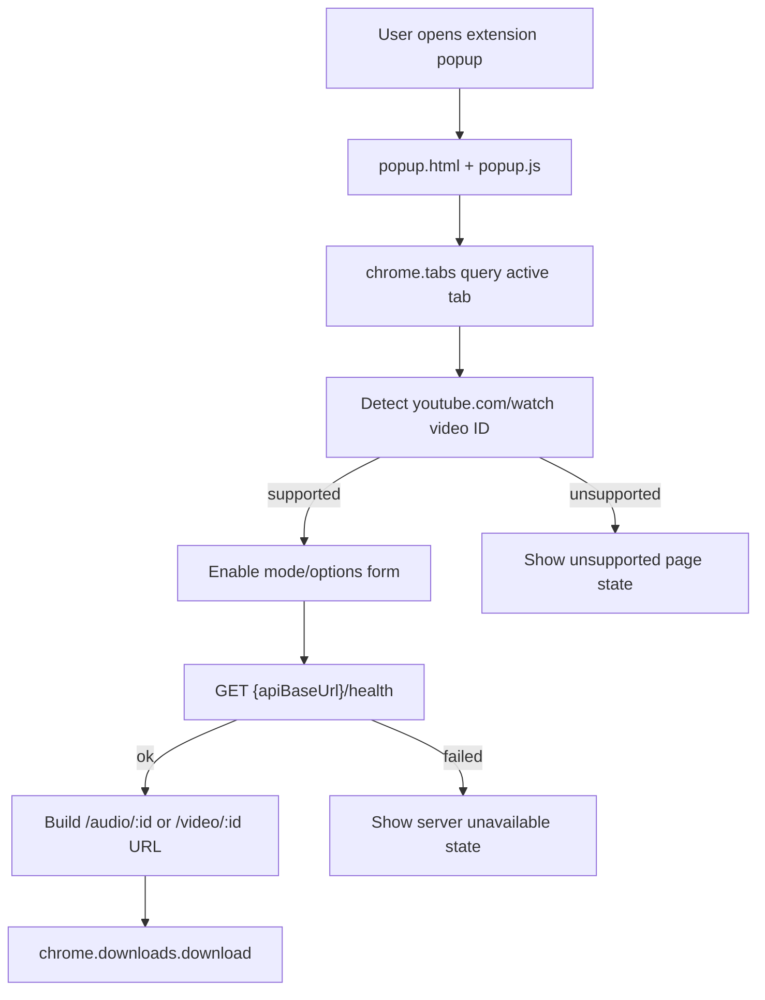

# Chrome Extension MVP Plan

## Summary

`apps/chrome-extension`에 이관된 snapshot을 실제 Chrome MV3 확장 프로그램으로 로드하고, YouTube watch 페이지에서 현재 영상 ID를 감지해 Media Nest API 다운로드를 시작하는 popup MVP를 만든다. 서버 API 계약은 변경하지 않고, extension 쪽 경로, popup UI, URL 생성, 다운로드 시작 흐름만 구현한다.

---

## Problem Frame

현재 Chrome extension 소스는 monorepo package로 추적되지만, `manifest.json`은 존재하지 않는 content script를 참조하고 popup asset 경로도 실제 파일 배치와 맞지 않는다. 사용자는 YouTube 페이지에서 URL을 직접 복사해 API URL을 조합해야 하므로, 문서화된 extension 제품 목표가 아직 실제 사용자 흐름으로 연결되지 않는다.

---

## Requirements

- R1. Chrome load unpacked에서 manifest 오류 없이 extension이 로드되어야 한다.
- R2. popup HTML이 실제 CSS와 script 파일을 정상 로드해야 한다.
- R3. popup은 현재 활성 탭의 `youtube.com/watch?v={id}` URL에서 11자 YouTube video ID를 감지해야 한다.
- R4. 지원하지 않는 탭에서는 다운로드 실행을 비활성화하고 상태를 표시해야 한다.
- R5. 사용자는 오디오/비디오 다운로드 모드를 선택할 수 있어야 한다.
- R6. 사용자는 API base URL, filename, audio bitrate, video resolution 옵션을 입력할 수 있어야 한다.
- R7. 오디오 모드는 Media Nest API의 `/audio/:id` 계약에 맞는 다운로드 URL을 생성해야 한다.
- R8. 비디오 모드는 Media Nest API의 `/video/:id` 계약에 맞는 다운로드 URL을 생성해야 한다.
- R9. 서버가 꺼져 있거나 `/health`가 정상 응답하지 않으면 다운로드 시작 전 서버 미응답 상태를 표시해야 한다.
- R10. API 서버 엔드포인트, CORS 정책, YouTube-only 서버 source policy는 이번 작업에서 변경하지 않는다.

---

## Scope Boundaries

- API 서버의 `/audio`, `/video`, `/health` 계약은 변경하지 않는다.
- Chrome Web Store 배포 자동화는 포함하지 않는다.
- 인증, 다운로드 이력, 작업 큐, 진행률 표시는 포함하지 않는다.
- shared package 또는 typed API client는 만들지 않는다.
- YouTube Shorts와 `youtu.be` 지원은 이번 MVP의 필수 성공 조건으로 두지 않는다.
- extension 번들러 도입은 하지 않고 현재 정적 HTML/CSS/JS package 구조를 유지한다.

### Deferred to Follow-Up Work

- `EXTENSION_ID` 기반 CORS allowlist 강제: extension origin 검증 방식이 확정된 뒤 별도 작업으로 다룬다.
- `host_permissions` 최소화: 실제 배포/개발 API base URL 정책이 정해진 뒤 좁힌다.
- Shorts와 `youtu.be` URL 지원: 일반 watch URL MVP가 안정화된 뒤 추가한다.
- 다운로드 진행률 표시: Chrome downloads API 이벤트 처리가 필요해 별도 UX 개선으로 분리한다.

---

## Context & Research

### Relevant Code and Patterns

- `docs/chrome-extension/current-implementation-prd.md`: popup 중심 MVP, 현재 탭 YouTube URL 감지, API base URL 설정, 지원하지 않는 페이지 상태를 제품 범위로 정의한다.
- `docs/chrome-extension/current-implementation-fsd.md`: manifest, popup 상태, API 호출 계약, 검증 기준을 정의한다.
- `apps/chrome-extension/manifest.json`: 현재 popup entry는 있으나 존재하지 않는 `index.js` content script를 참조한다.
- `apps/chrome-extension/popup/popup.html`: 현재 CSS/JS 상대 경로가 실제 `styles/`, `scripts/` 위치와 맞지 않는다.
- `apps/chrome-extension/scripts/popup.js`: 현재 checkbox와 임의 version 표시만 처리한다.
- `apps/chrome-extension/package.json`: 현재 build/lint/test는 snapshot 확인 수준의 placeholder다.
- `docs/api/current-implementation-prd.md`, `docs/api/current-implementation-fsd.md`: extension이 소비할 API 계약의 source of truth다.

### Institutional Learnings

- No relevant `docs/solutions/` material was present in this repo.

### External References

- External research is not required for this plan. The work uses standard MV3 popup APIs and existing local PRD/FSD already define the behavior and constraints.

---

## Key Technical Decisions

- Keep the extension as static MV3 files: current package has no bundler and the MVP does not need shared packages or build output.
- Remove the broken content script path for the popup-first MVP: `content_scripts` is not required to read the active tab URL from the popup.
- Prefer `chrome.downloads.download` for starting downloads: it gives clearer failure feedback than simply opening a new tab, matching the FSD preference.
- Add the `downloads` permission only when the download API is used: permission changes should track actual behavior rather than stay speculative.
- Use the video ID path endpoints for MVP downloads: `/audio/:id` and `/video/:id` avoid sending a full URL through query string and align with the existing API contract.
- Store API base URL and option defaults in `chrome.storage`: this matches the existing `storage` permission and keeps local/deployed server configuration user-adjustable.

---

## Open Questions

### Resolved During Planning

- Should this introduce a bundler or framework: No. The current extension package is static and the MVP can be built with plain HTML/CSS/JS.
- Should the server API change to support extension usage: No. The current `/audio/:id`, `/video/:id`, and `/health` contracts are sufficient.
- Should content scripts remain active: No for MVP. Popup-driven active tab inspection covers the documented first flow.

### Deferred to Implementation

- Exact popup copy and control labels: choose during implementation while keeping the documented states clear.
- Final `chrome.downloads.download` fallback behavior: if Chrome permission or runtime constraints block it, fall back to opening the generated download URL and document the deviation.
- Exact test harness shape for popup logic: decide whether lightweight Node tests around pure URL-builder functions are enough or whether a small browser-based smoke harness is worth adding.

---

## High-Level Technical Design

> *This illustrates the intended approach and is directional guidance for review, not implementation specification. The implementing agent should treat it as context, not code to reproduce.*

---

## Implementation Units

### U1. Repair Manifest And Popup Asset Wiring

**Goal:** Extension이 Chrome load unpacked에서 기본 파일 참조 오류 없이 로드되도록 manifest와 popup asset 경로를 정리한다.

**Requirements:** R1, R2, R10

**Dependencies:** None

**Files:**
- Modify: `apps/chrome-extension/manifest.json`
- Modify: `apps/chrome-extension/popup/popup.html`
- Modify: `apps/chrome-extension/package.json`
- Test: `apps/chrome-extension/package.json`

**Approach:**
- Popup 중심 MVP에 필요 없는 broken `index.js` content script 참조를 제거한다.
- `popup/popup.html`에서 CSS/JS 상대 경로를 실제 파일 배치에 맞춘다.
- `chrome.downloads.download`를 쓰는 경우 manifest permission에 `downloads`를 추가한다.
- `build` script는 manifest, popup HTML, referenced CSS/JS 파일 존재 여부를 확인하도록 강화한다.

**Execution note:** Characterization-first. 현재 broken reference를 먼저 검증하는 package-level check를 추가한 뒤 manifest/popup 경로를 수정한다.

**Patterns to follow:**
- 현재 `apps/chrome-extension/package.json`의 의존성 없는 Node one-liner 검증 방식을 유지하되, 검증 범위를 실제 asset reference까지 넓힌다.

**Test scenarios:**
- Error path: popup HTML이 존재하지 않는 CSS 또는 JS를 참조하면 `pnpm --filter chrome-extension run build`가 실패한다.
- Error path: manifest가 존재하지 않는 content script를 참조하면 package verification이 실패한다.
- Happy path: 수정 후 manifest, popup HTML, CSS, JS 파일 참조가 모두 존재해 build script가 통과한다.

**Verification:**
- Chrome load unpacked에서 manifest file reference 오류가 없어야 한다.
- `pnpm --filter chrome-extension run build`가 실제 참조 파일 존재를 검증해야 한다.

### U2. Build Popup UI And State Model

**Goal:** 사용자가 현재 탭 상태, API base URL, 다운로드 모드, 파일 옵션을 한 popup에서 확인하고 조정할 수 있게 한다.

**Requirements:** R3, R4, R5, R6

**Dependencies:** U1

**Files:**
- Modify: `apps/chrome-extension/popup/popup.html`
- Modify: `apps/chrome-extension/styles/index.css`
- Modify: `apps/chrome-extension/scripts/popup.js`
- Test: `apps/chrome-extension/package.json`

**Approach:**
- 기존 checkbox/version snapshot UI를 제거하고, MVP에 필요한 form controls로 교체한다.
- Popup 상태는 ready, unsupported page, missing API URL, checking server, server unavailable, download starting, download failed를 표현할 수 있게 둔다.
- API base URL과 기본 옵션은 `chrome.storage`에서 로드하고 변경 시 저장한다.
- 오디오 모드일 때 bitrate 옵션, 비디오 모드일 때 resolution 옵션을 보여주거나 활성화한다.

**Patterns to follow:**
- `docs/chrome-extension/current-implementation-fsd.md`의 popup 상태 표와 옵션 입력 범위.
- 기존 정적 HTML/CSS/JS 구조. 새 프레임워크나 빌드 단계는 추가하지 않는다.

**Test scenarios:**
- Happy path: 저장된 API base URL이 있으면 popup 초기화 시 입력값에 반영된다.
- Happy path: audio/video 모드 전환 시 해당 옵션 입력만 사용 가능한 상태가 된다.
- Edge case: API base URL이 비어 있거나 URL 형식이 아니면 다운로드 버튼이 비활성화되고 missing API URL 상태가 표시된다.
- Edge case: 현재 탭이 지원되지 않으면 옵션은 보이더라도 다운로드 액션은 비활성화된다.

**Verification:**
- Popup이 작은 extension viewport에서 텍스트 겹침 없이 모든 필수 옵션을 표시해야 한다.
- 상태 변경이 사용자 액션과 현재 탭 감지 결과에 맞게 반영되어야 한다.

### U3. Implement Active Tab Detection And API URL Builder

**Goal:** 현재 활성 탭에서 YouTube video ID를 감지하고, 선택된 모드와 옵션에 따라 Media Nest API 다운로드 URL을 생성한다.

**Requirements:** R3, R4, R7, R8

**Dependencies:** U2

**Files:**
- Modify: `apps/chrome-extension/scripts/popup.js`
- Test: `apps/chrome-extension/package.json`

**Approach:**
- Popup 초기화 시 `chrome.tabs`로 현재 활성 탭 URL을 읽는다.
- MVP 필수 성공 조건은 `youtube.com/watch?v={id}`이며, video ID는 11자 형식으로 검증한다.
- 다운로드 URL은 `/audio/{id}` 또는 `/video/{id}` path endpoint를 우선 사용한다.
- 빈 filename, bitrate, resolution은 query string에 넣지 않고 API 기본 동작에 맡긴다.
- URL builder처럼 테스트 가능한 순수 로직은 popup script 안에서 작게 분리하거나 별도 JS 파일로 분리한다.

**Execution note:** Test-first. URL 감지와 URL 생성은 Chrome runtime 없이 검증 가능한 순수 로직으로 먼저 고정한다.

**Patterns to follow:**
- API path와 query 계약은 `docs/api/current-implementation-prd.md`와 `docs/api/current-implementation-fsd.md`를 따른다.
- YouTube ID 형식은 API 서버의 11자 영상 ID 검증과 같은 사용자-visible 기준을 따른다.

**Test scenarios:**
- Happy path: `https://www.youtube.com/watch?v=abc123_DEF0`에서 `abc123_DEF0`을 감지한다.
- Happy path: audio mode와 filename/bitrate가 있으면 `/audio/abc123_DEF0?filename=...&bitrate=...` 형태의 URL을 만든다.
- Happy path: video mode와 filename/resolution이 있으면 `/video/abc123_DEF0?filename=...&resolution=...` 형태의 URL을 만든다.
- Edge case: 추가 YouTube query parameter가 있어도 `v` 값만 사용한다.
- Edge case: filename, bitrate, resolution이 비어 있으면 해당 query parameter를 생략한다.
- Error path: non-YouTube URL, watch URL이 아닌 YouTube URL, 11자가 아닌 `v` 값은 unsupported로 분류한다.

**Verification:**
- 지원 가능한 YouTube watch URL에서만 다운로드 URL이 생성되어야 한다.
- 생성 URL은 API 문서의 path endpoint와 optional query 계약을 따라야 한다.

### U4. Add Server Health Check And Download Start Flow

**Goal:** 다운로드 시작 전에 서버 상태를 확인하고, 정상일 때 Chrome 다운로드 API로 다운로드를 시작한다.

**Requirements:** R5, R7, R8, R9

**Dependencies:** U3

**Files:**
- Modify: `apps/chrome-extension/manifest.json`
- Modify: `apps/chrome-extension/scripts/popup.js`
- Modify: `apps/chrome-extension/popup/popup.html`
- Modify: `apps/chrome-extension/styles/index.css`
- Test: `apps/chrome-extension/package.json`

**Approach:**
- 다운로드 버튼 클릭 시 중복 실행을 막고 checking server 상태로 전환한다.
- `GET /health`가 `{ ok: true }`로 응답할 때만 다운로드 URL을 실행한다.
- `chrome.downloads.download` 실패는 download failed 상태로 표시한다.
- 서버 연결 실패, 비정상 health 응답, 다운로드 API 실패를 구분 가능한 상태로 다루되 서버 내부 오류 원문은 UI에 그대로 노출하지 않는다.

**Patterns to follow:**
- API health 계약은 `GET /health`의 `{ "ok": true }` 응답을 기준으로 한다.
- Popup 상태는 FSD의 상태 표를 따른다.

**Test scenarios:**
- Happy path: health check가 ok이면 선택된 모드의 다운로드 URL로 Chrome download를 시작한다.
- Error path: health 요청이 실패하면 다운로드를 시작하지 않고 server unavailable 상태를 표시한다.
- Error path: health 응답이 `{ ok: true }`가 아니면 다운로드를 시작하지 않는다.
- Error path: Chrome download API가 실패하면 download failed 상태를 표시하고 버튼을 다시 사용할 수 있게 한다.
- Edge case: download starting 상태에서 사용자가 버튼을 반복 클릭해도 중복 다운로드가 시작되지 않는다.

**Verification:**
- 서버가 꺼진 상태에서는 다운로드 URL이 실행되지 않아야 한다.
- 서버가 켜진 상태에서는 선택된 audio/video URL로 다운로드 시작이 시도되어야 한다.

### U5. Update Docs And Manual Verification Notes

**Goal:** 실제 extension MVP 동작과 문서를 맞추고, 사람이 확인해야 하는 Chrome load unpacked 검증 절차를 남긴다.

**Requirements:** R1, R2, R3, R4, R9, R10

**Dependencies:** U1, U2, U3, U4

**Files:**
- Modify: `README.md`
- Modify: `docs/chrome-extension/current-implementation-prd.md`
- Modify: `docs/chrome-extension/current-implementation-fsd.md`
- Modify: `docs/plans/2026-06-18-005-chrome-extension-path-fixes-follow-up-plan.md`

**Approach:**
- README에서 extension이 단순 source snapshot이라는 설명을 MVP 구현 상태에 맞게 갱신한다.
- PRD/FSD의 "현재 소스 상태"와 "검증 기준"을 실제 구현 결과에 맞춘다.
- 기존 follow-up plan은 완료된 항목과 남은 보류 항목을 구분해 갱신한다.

**Patterns to follow:**
- 현재 README의 짧은 운영/검증 명령 중심 구성.
- `docs/chrome-extension` 문서의 PRD/FSD 분리 방식.

**Test scenarios:**
- Test expectation: none -- 문서 정합성 작업이며 행동 변화는 U1-U4에서 검증한다.

**Verification:**
- README와 chrome-extension PRD/FSD가 더 이상 broken `index.js`, popup asset 경로 오류를 현재 한계로 설명하지 않아야 한다.
- 문서가 API 서버 계약 변경 없이 extension MVP가 소비하는 흐름을 설명해야 한다.

---

## System-Wide Impact

- **Interaction graph:** Chrome popup, Chrome tabs API, Chrome storage API, Chrome downloads API, Media Nest `/health`, `/audio/:id`, `/video/:id`가 연결된다.
- **Error propagation:** 서버 미응답과 다운로드 시작 실패는 popup 상태로만 표시하고, API 서버 내부 오류 원문은 UI에 노출하지 않는다.
- **State lifecycle risks:** popup은 짧게 열렸다 닫히므로 저장 설정, active tab 조회, download starting 중복 클릭 방지가 핵심이다.
- **API surface parity:** 서버 API는 변경하지 않고 extension이 기존 path endpoint를 소비한다.
- **Integration coverage:** Chrome load unpacked, popup asset 로드, 실제 YouTube tab 감지는 package-level Node test만으로 증명되지 않으므로 수동 browser smoke가 필요하다.
- **Unchanged invariants:** API 서버 CORS 전체 허용, non-YouTube URL 서버 호환성, timeout/concurrency 정책은 변경하지 않는다.

---

## Risks & Dependencies

| Risk | Mitigation |
|------|------------|
| Chrome extension API는 Node unit test로 완전히 검증하기 어렵다 | URL 감지/URL 생성은 순수 로직 테스트로 고정하고, Chrome load unpacked smoke를 별도 검증 게이트로 둔다 |
| `chrome.downloads.download` 권한 또는 동작 제약이 구현 중 확인될 수 있다 | FSD에 명시된 fallback인 다운로드 URL 열기 방식으로 축소할 수 있게 U4에 deferred implementation note를 둔다 |
| `host_permissions`를 너무 넓게 유지할 수 있다 | MVP에서는 현재 동작을 우선하고, 실제 API base URL 정책이 정해진 뒤 후속 작업으로 최소화한다 |
| popup UI가 작은 viewport에서 과밀해질 수 있다 | 기능 설명 문구보다 조작 controls와 상태 표시를 우선하고, compact layout으로 검증한다 |
| 서버 health check가 다운로드 가능성을 완전히 보장하지 않는다 | `/health`는 프로세스 응답성만 확인한다는 API 문서의 한계를 유지하고, 실제 다운로드 실패는 download failed 상태로 다룬다 |

---

## Documentation / Operational Notes

- Extension MVP 검증은 API 서버가 로컬에서 실행 중인 상태와 꺼진 상태를 모두 확인해야 한다.
- Chrome load unpacked 수동 검증은 `apps/chrome-extension` 디렉터리를 대상으로 한다.
- `pnpm --filter chrome-extension run build`는 실제 번들이 아니라 정적 파일 참조 검증으로 유지한다.
- API 서버 문서는 endpoint 계약이 바뀌지 않는 한 수정하지 않는다.

---

## Sources & References

- Chrome extension PRD: `docs/chrome-extension/current-implementation-prd.md`
- Chrome extension FSD: `docs/chrome-extension/current-implementation-fsd.md`
- API PRD: `docs/api/current-implementation-prd.md`
- API FSD: `docs/api/current-implementation-fsd.md`
- Existing follow-up plan: `docs/plans/2026-06-18-005-chrome-extension-path-fixes-follow-up-plan.md`
- Extension manifest: `apps/chrome-extension/manifest.json`
- Extension popup: `apps/chrome-extension/popup/popup.html`
- Extension popup script: `apps/chrome-extension/scripts/popup.js`
