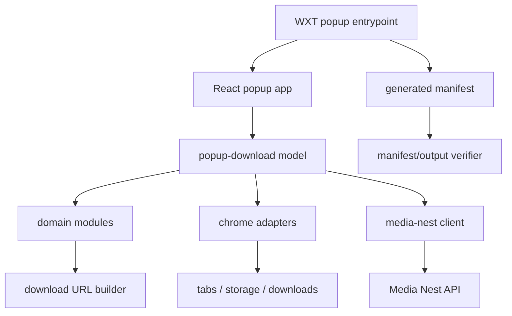

# Migrate Chrome Extension To WXT React

## Summary

`apps/chrome-extension`을 WXT + React + TypeScript 구조로 in-place 마이그레이션한다. 현재 popup MVP의 사용자 동작과 Media Nest API 계약은 유지하고, 로컬 `dev` 실행, WXT build output, Chrome API adapter, React UI, 순수 domain/service module의 경계를 분리해 유지보수와 디버깅 흐름을 개선한다.

---

## Problem Frame

현재 extension은 정적 MV3 파일 구조로 동작하지만 `scripts/popup.js`가 DOM, popup state, Chrome APIs, storage, fetch, download 시작 흐름을 모두 가진다. 이 상태에서 React만 얹으면 React component가 같은 책임을 그대로 떠안는 shallow module이 되므로, framework migration과 module boundary 재설계를 함께 계획해야 한다.

---

## Requirements

- R1. Chrome extension은 WXT + React + TypeScript 기반으로 로컬 개발 서버와 production build를 실행할 수 있어야 한다.
- R2. 현재 popup MVP의 기능 범위는 유지되어야 한다: YouTube watch URL 감지, audio/video 모드, API base URL, filename, bitrate, resolution, `/health` 확인, 다운로드 시작.
- R3. 기존 저장 키 `apiBaseUrl`, `filename`, `bitrate`, `resolution`, `mode`는 호환되어야 한다.
- R4. Media Nest API 계약은 변경하지 않는다: `/health`, `/audio/:id`, `/video/:id`, 빈 optional query 생략.
- R5. WXT/React entrypoint 코드는 UI와 mount/wiring에 집중하고, Chrome API, API client, URL 감지, option normalization, state transition은 React 밖 module로 분리해야 한다.
- R6. build output의 generated manifest, popup asset, icon, permission drift를 검증할 수 있어야 한다.
- R7. local debugging 문서는 WXT dev output과 production build load-unpacked 경로를 명확히 안내해야 한다.
- R8. browser smoke는 supported YouTube watch page, unsupported page, server unavailable, successful download start 경로를 확인할 수 있어야 한다.

---

## Scope Boundaries

- API 서버 구현, endpoint, CORS 정책, YouTube-only source policy는 변경하지 않는다.
- Chrome Web Store 배포 자동화는 포함하지 않는다.
- 다운로드 진행률, 다운로드 이력, 작업 큐, 계정/인증은 포함하지 않는다.
- YouTube Shorts와 `youtu.be` 지원을 새로 추가하지 않는다.
- `packages/*` shared contract package는 이번 migration에서 만들지 않는다.
- React Router 또는 multi-page extension app 구조는 도입하지 않는다. Popup 단일 UI를 먼저 안정화한다.

### Deferred to Follow-Up Work

- `host_permissions` 최소화: 사용자 지정 API base URL 정책과 배포 환경이 정해진 뒤 좁힌다.
- `EXTENSION_ID` 기반 CORS allowlist: extension ID와 배포 전략이 확정된 뒤 API 쪽 작업으로 분리한다.
- options page 또는 side panel: popup MVP가 WXT/React 구조로 안정화된 뒤 검토한다.
- shared API client package: API consumer가 extension 외에 늘어나는 시점에 별도 refactor로 검토한다.

---

## Context & Research

### Relevant Code and Patterns

- `apps/chrome-extension/package.json`: 현재 `build`, `lint`, `test`만 있고 `dev` script가 없다.
- `apps/chrome-extension/manifest.json`: 현재 MV3 manifest가 `storage`, `activeTab`, `downloads`, `<all_urls>` host permission을 직접 선언한다.
- `apps/chrome-extension/popup/popup.html`: 현재 popup form과 script/style 경로를 직접 소유한다.
- `apps/chrome-extension/scripts/popup.js`: DOM, Chrome API, storage, health check, download start flow가 한 파일에 결합되어 있다.
- `apps/chrome-extension/scripts/popup-utils.mjs`: YouTube ID 감지와 URL builder가 Chrome runtime 없이 테스트 가능한 순수 로직으로 분리되어 있다.
- `apps/chrome-extension/tests/popup-url-builder.test.mjs`: 현재 보존해야 할 URL 감지와 URL 생성 behavior의 characterization baseline이다.
- `apps/chrome-extension/tools/verify-extension-package.js`: manifest/popup 정적 파일 참조를 검증하는 기존 package-level build check다.
- `docs/chrome-extension/current-implementation-prd.md`: 현재 popup MVP의 제품 범위와 out-of-scope를 정의한다.
- `docs/chrome-extension/current-implementation-fsd.md`: extension 상태, API 호출 계약, 권한, 검증 기준의 source of truth다.
- `docs/plans/2026-06-19-001-feat-chrome-extension-mvp-plan.md`: 현재 MVP 구현의 완료된 계획이며 이번 migration은 그 동작을 보존한다.

### Institutional Learnings

- 코드 아키텍처 서브에이전트 검토 결과, WXT 전용 코드는 entrypoint에만 두고 Chrome/API/domain 로직은 React/WXT 밖에서도 테스트 가능한 TypeScript module로 분리하는 방향이 가장 유지보수에 적합하다.
- root workspace는 pnpm + Turbo 기반이며 `turbo.json`의 `dev` task는 persistent/cached false로 설정되어 있어 extension package의 `dev` script를 추가하면 root `dev` 흐름에 자연스럽게 연결된다.

### External References

- WXT docs: WXT는 Vite를 내부 bundler로 사용하고, `wxt.config.ts`에서 Vite config를 확장할 수 있다.
- WXT frontend framework docs: React는 `@wxt-dev/module-react`로 설정할 수 있고, extension UI는 entrypoint별 app instance를 갖는 구조가 권장된다.
- npm registry 확인 시점 기준: `wxt@0.20.26`, `@wxt-dev/module-react@1.2.2`, `react@19.2.7`, `react-dom@19.2.7`, `vitest@4.1.9`, `typescript@6.0.3`이 latest로 확인되었다. 실제 구현에서는 lockfile과 기존 repo TypeScript 정책에 맞춰 버전을 확정한다.

---

## Key Technical Decisions

- Choose WXT + React over Plasmo or CRXJS: WXT가 extension entrypoint, generated manifest, dev server, Vite integration을 함께 제공하면서 React에 종속되지 않는 구조를 만들기 쉽다.
- Keep migration in `apps/chrome-extension`: 새 package를 만들지 않고 기존 workspace package를 WXT package로 전환해 repo ownership과 docs 경로를 유지한다.
- Use React for popup UI only: popup screen state and controls are React-owned, but Chrome/API/download behavior lives behind services and adapters.
- Preserve storage key compatibility: saved user options should survive migration without one-off data conversion.
- Keep API contract local to extension service module: server internals from `apps/api/src/*` must not be imported into the extension.
- Verify generated output, not only source files: WXT source can be valid while generated manifest or copied assets drift, so build verification should inspect WXT output.
- Do behavior-preserving migration before enhancements: Shorts, `youtu.be`, progress display, permission tightening, and options page remain follow-up work.

---

## Open Questions

### Resolved During Planning

- Should the migration use Plasmo because it is React-first: No. React-first startup is attractive, but current priority is maintainable extension structure and local debugging, where WXT is the better fit.
- Should CRXJS be used because it is closest to Vite: No. CRXJS improves bundling/HMR, but leaves more architecture and manifest structure to the repo.
- Should a shared package be introduced for API contracts: No. Current extension is the only browser consumer, so a local service module gives enough locality without expanding the monorepo surface.
- Should current unused `background.js` and `scripts/content.js` become active WXT entrypoints: No for current behavior. They should be removed or left out unless a concrete behavior needs them.

### Deferred to Implementation

- Final dependency versions: choose during implementation from current npm latest, lockfile compatibility, and WXT peer requirements.
- Exact test runner shape for React UI: decide between Vitest DOM tests and minimal application-service tests after dependency installation.
- Exact WXT output directory in scripts: follow WXT defaults unless implementation reveals repo-specific reasons to set `outDir`.

---

## Output Structure

The tree below shows the intended target shape. It is a scope declaration, not a file-by-file implementation mandate.

```text
apps/chrome-extension/
  entrypoints/
    popup/
      index.html
      main.tsx
      style.css
  public/
    icons/
  src/
    app/
      popup-app.tsx
    features/
      popup-download/
        popup-download-model.ts
    domain/
      youtube/
        youtube-url.ts
      download-options/
        download-options.ts
      popup-state/
        popup-state.ts
    services/
      media-nest/
        download-url.ts
        media-nest-client.ts
    adapters/
      chrome/
        downloads.ts
        storage.ts
        tabs.ts
    shared/
      constants.ts
  tests/
    unit/
    integration/
    manifest/
  tools/
    verify-extension-package.js
  wxt.config.ts
  tsconfig.json
```

---

## High-Level Technical Design

> *This illustrates the intended approach and is directional guidance for review, not implementation specification. The implementing agent should treat it as context, not code to reproduce.*



---

## Implementation Units

### U1. Establish Behavior Preservation Baseline

**Goal:** 현재 popup MVP에서 반드시 보존해야 하는 URL, storage, API, permission, status behavior를 migration 전에 테스트와 문서 기준으로 고정한다.

**Requirements:** R2, R3, R4

**Dependencies:** None

**Files:**
- Modify: `apps/chrome-extension/tests/popup-url-builder.test.mjs`
- Modify: `docs/chrome-extension/current-implementation-fsd.md`
- Modify: `docs/chrome-extension/current-implementation-prd.md`

**Approach:**
- 현재 테스트가 감싸는 YouTube ID 감지, API base URL normalization, audio/video URL generation을 migration baseline으로 명시한다.
- 저장 키 호환성, `/health` 선확인, optional query 생략, unsupported page 상태를 보존 behavior로 문서화한다.
- 테스트가 아직 덮지 않는 storage key와 status transition은 후속 unit에서 새 테스트 표면으로 끌고 간다.

**Execution note:** Characterization-first. 동작 변경 없이 현재 behavior를 먼저 고정한 뒤 구조를 바꾼다.

**Patterns to follow:**
- `apps/chrome-extension/tests/popup-url-builder.test.mjs`의 Chrome runtime 없는 순수 로직 테스트 패턴.
- `docs/chrome-extension/current-implementation-fsd.md`의 상태 표와 API 계약.

**Test scenarios:**
- Happy path: 일반 YouTube watch URL에서 11자 video ID가 감지된다.
- Happy path: audio/video mode별 다운로드 URL이 기존 path endpoint 계약과 일치한다.
- Edge case: 빈 optional option은 query string에서 생략된다.
- Error path: unsupported URL은 다운로드 URL 생성 대상이 되지 않는다.

**Verification:**
- Migration 전후 같은 입력에 대해 기존 URL 감지와 URL 생성 결과가 유지되어야 한다.
- 문서가 현재 구현과 migration 보존 기준을 구분해서 설명해야 한다.

### U2. Introduce WXT React Package Shell

**Goal:** 기존 extension package를 WXT + React + TypeScript package로 전환하고, root/turbo dev flow에서 로컬 실행 가능한 shell을 만든다.

**Requirements:** R1, R6, R7

**Dependencies:** U1

**Files:**
- Modify: `apps/chrome-extension/package.json`
- Create: `apps/chrome-extension/wxt.config.ts`
- Create: `apps/chrome-extension/tsconfig.json`
- Create: `apps/chrome-extension/entrypoints/popup/index.html`
- Create: `apps/chrome-extension/entrypoints/popup/main.tsx`
- Create: `apps/chrome-extension/entrypoints/popup/style.css`
- Modify: `turbo.json`
- Test: `apps/chrome-extension/tests/manifest/`

**Approach:**
- WXT scripts를 package `dev`, `build`, `zip` 흐름에 연결하고, root `turbo run dev --parallel`에서 extension dev server가 persistent task로 동작하게 한다.
- `@wxt-dev/module-react`를 사용해 React entrypoint 설정을 명시한다.
- 기존 icons는 WXT public/static asset 규칙에 맞춰 이동하거나 복사되도록 계획한다.
- 기존 `manifest.json` 직접 소유 방식에서 WXT config 기반 generated manifest 방식으로 전환한다.

**Patterns to follow:**
- root `package.json`과 `turbo.json`의 workspace task 구조.
- WXT docs의 `entrypoints/`와 React module configuration.

**Test scenarios:**
- Happy path: WXT build output에 popup HTML, script bundle, icons, manifest가 생성된다.
- Error path: generated manifest에서 required permission이나 popup path가 빠지면 manifest verification이 실패한다.
- Integration: root dev task가 extension dev task를 장기 실행 task로 취급한다.

**Verification:**
- Local WXT dev mode로 extension popup shell을 열 수 있어야 한다.
- Production build output이 Chrome load unpacked 대상으로 사용할 수 있는 구조여야 한다.

### U3. Move Domain And Media Nest Service Logic To TypeScript

**Goal:** 현재 `popup-utils.mjs`의 순수 로직과 API URL 계약을 TypeScript domain/service module로 이관한다.

**Requirements:** R2, R4, R5

**Dependencies:** U2

**Files:**
- Create: `apps/chrome-extension/src/domain/youtube/youtube-url.ts`
- Create: `apps/chrome-extension/src/domain/download-options/download-options.ts`
- Create: `apps/chrome-extension/src/services/media-nest/download-url.ts`
- Create: `apps/chrome-extension/src/services/media-nest/media-nest-client.ts`
- Create: `apps/chrome-extension/src/shared/constants.ts`
- Modify: `apps/chrome-extension/tests/unit/`
- Remove or retire: `apps/chrome-extension/scripts/popup-utils.mjs`

**Approach:**
- YouTube URL 감지는 domain module이 소유한다.
- Download option normalization과 optional query 생략 규칙은 download option/service module이 소유한다.
- `/health`, `/audio/:id`, `/video/:id` 소비는 Media Nest service module이 소유한다.
- API server 내부 import 없이 extension-local contract consumer로 유지한다.

**Execution note:** Test-first. 기존 `popup-url-builder` 테스트를 TypeScript unit test로 옮긴 뒤 migration한다.

**Patterns to follow:**
- 기존 `popup-utils.mjs`의 작은 interface와 Chrome runtime 없는 테스트 가능성.
- `docs/api/current-implementation-fsd.md`의 API path/query 계약.

**Test scenarios:**
- Happy path: `youtube.com/watch?v=abc123_DEF0`와 `www.youtube.com/watch?v=abc123_DEF0`은 같은 video ID를 반환한다.
- Edge case: extra query parameter가 있어도 `v` 값만 사용한다.
- Error path: non-http API base URL은 거부된다.
- Error path: unsupported download mode와 invalid video ID는 URL 생성 전에 거부된다.
- Happy path: health URL은 normalized API base URL에서 생성된다.

**Verification:**
- 기존 Node test coverage가 TypeScript/Vitest 기반 unit test로 동등하게 이전되어야 한다.
- Domain/service module은 React와 WXT import 없이 테스트 가능해야 한다.

### U4. Create Chrome API Adapters

**Goal:** `chrome.tabs`, `chrome.storage`, `chrome.downloads`를 Promise 기반 adapter로 감싸 popup application layer가 Chrome callback API에 직접 결합되지 않게 한다.

**Requirements:** R2, R3, R5

**Dependencies:** U3

**Files:**
- Create: `apps/chrome-extension/src/adapters/chrome/tabs.ts`
- Create: `apps/chrome-extension/src/adapters/chrome/storage.ts`
- Create: `apps/chrome-extension/src/adapters/chrome/downloads.ts`
- Create: `apps/chrome-extension/tests/integration/`

**Approach:**
- Active tab URL 조회는 tabs adapter가 소유한다.
- Storage adapter는 기존 저장 키를 그대로 사용하고 default option merge를 명확히 한다.
- Downloads adapter는 `chrome.runtime.lastError`와 missing download ID를 failure로 변환한다.
- Adapter interface를 통해 test에서는 fake adapter를 주입할 수 있게 한다.

**Patterns to follow:**
- 기존 `scripts/popup.js`의 callback-to-Promise wrapping 방식.
- `docs/chrome-extension/current-implementation-fsd.md`의 Chrome permission과 popup 상태 흐름.

**Test scenarios:**
- Happy path: tabs adapter가 active tab URL을 application layer에 전달한다.
- Happy path: storage adapter가 기존 key 값과 default option을 병합한다.
- Error path: `chrome.runtime.lastError`가 있으면 tabs/storage/downloads adapter가 failure로 변환한다.
- Edge case: downloads API가 ID를 반환하지 않으면 다운로드 시작 실패로 처리한다.

**Verification:**
- Application layer와 React component가 raw `chrome.*` callback API를 직접 호출하지 않아야 한다.
- 기존 저장값이 migration 후에도 같은 key로 읽혀야 한다.

### U5. Build Popup Application Model Outside React

**Goal:** popup 초기화, active tab 감지, ready/unsupported/missing API/server unavailable/download 상태, 중복 클릭 방지를 React 밖 application model로 구성한다.

**Requirements:** R2, R3, R5

**Dependencies:** U4

**Files:**
- Create: `apps/chrome-extension/src/features/popup-download/popup-download-model.ts`
- Create: `apps/chrome-extension/src/domain/popup-state/popup-state.ts`
- Modify: `apps/chrome-extension/tests/integration/`

**Approach:**
- Popup lifecycle을 explicit state transition으로 표현한다.
- Form option change는 저장과 ready-state recalculation을 트리거한다.
- Download submit은 server health check, URL build, downloads adapter 순서로 진행한다.
- Checking/downloading 중에는 duplicate submit을 막는다.

**Execution note:** Test-first for state transitions. React 렌더링보다 application behavior를 먼저 고정한다.

**Patterns to follow:**
- `docs/chrome-extension/current-implementation-fsd.md`의 popup 상태 표.
- 현재 `scripts/popup.js`의 `state.downloading`, `renderReadyState`, `assertServerAvailable`, `startDownload` 동작.

**Test scenarios:**
- Happy path: supported YouTube tab과 valid API base URL이면 ready 상태와 enabled action이 된다.
- Edge case: unsupported tab이면 unsupported state와 disabled action이 된다.
- Edge case: invalid API base URL이면 missing API URL state와 disabled action이 된다.
- Error path: health check fetch failure는 server unavailable state로 바뀐다.
- Error path: download adapter failure는 download failed state로 바뀌고 재시도 가능한 상태가 된다.
- Integration: duplicate submit during checking/downloading does not start a second download.

**Verification:**
- Popup behavior tests가 React DOM 없이 model/fake adapter 수준에서 핵심 상태 전이를 검증해야 한다.
- React component는 state rendering과 user event forwarding에 집중해야 한다.

### U6. Connect React Popup UI

**Goal:** WXT popup entrypoint에 React UI를 연결해 현재 popup MVP의 화면과 동작을 유지한다.

**Requirements:** R1, R2, R5, R7

**Dependencies:** U5

**Files:**
- Create: `apps/chrome-extension/src/app/popup-app.tsx`
- Create: `apps/chrome-extension/src/features/popup-download/ui/`
- Modify: `apps/chrome-extension/entrypoints/popup/main.tsx`
- Modify: `apps/chrome-extension/entrypoints/popup/style.css`
- Remove or retire: `apps/chrome-extension/popup/popup.html`
- Remove or retire: `apps/chrome-extension/scripts/popup.js`
- Modify: `apps/chrome-extension/tests/integration/`

**Approach:**
- React app은 application model을 초기화하고 state snapshot을 화면에 렌더링한다.
- Form controls는 현재 popup과 같은 option set을 제공한다.
- Audio/video mode에 따라 bitrate/resolution field visibility와 disabled state를 반영한다.
- Status copy는 현재 사용자-visible 상태 의미를 유지한다.

**Patterns to follow:**
- 기존 `popup/popup.html`의 control set.
- 기존 `styles/index.css`의 compact popup viewport 우선 스타일.
- `react-component-structure`와 `react-component-file-naming` 규칙은 실제 React 파일 작성 시 적용한다.

**Test scenarios:**
- Happy path: ready state에서는 video ID 상태와 enabled download action이 표시된다.
- Edge case: unsupported state에서는 action이 disabled이고 안내 상태가 표시된다.
- Edge case: audio mode에서는 bitrate field가 활성화되고 resolution field는 비활성화된다.
- Edge case: video mode에서는 resolution field가 활성화되고 bitrate field는 비활성화된다.
- Error path: server unavailable state가 사용자에게 표시된다.

**Verification:**
- Popup viewport에서 text overlap 없이 controls가 표시되어야 한다.
- React UI가 기존 MVP와 같은 user-visible flow를 제공해야 한다.

### U7. Verify WXT Build Output And Browser Smoke

**Goal:** WXT generated output 기준으로 manifest/assets/permissions를 검증하고 실제 브라우저에서 extension smoke 경로를 확인한다.

**Requirements:** R6, R8

**Dependencies:** U6

**Files:**
- Modify: `apps/chrome-extension/tools/verify-extension-package.js`
- Create: `apps/chrome-extension/tests/manifest/`
- Create: `apps/chrome-extension/tests/browser/`
- Modify: `apps/chrome-extension/package.json`

**Approach:**
- 기존 static source verifier를 WXT build output verifier로 전환한다.
- Generated manifest에서 popup, icons, permissions, host permissions를 확인한다.
- Browser smoke는 fake local API를 사용해 supported page, unsupported page, server unavailable, download started state를 확인한다.
- Production build output과 dev output 중 어떤 경로를 load unpacked 대상으로 쓰는지 테스트/문서에서 분리한다.

**Patterns to follow:**
- 기존 `tools/verify-extension-package.js`의 package-local verifier 역할.
- 이전 browser smoke에서 검증한 popup title, status, fake API request, download start 흐름.

**Test scenarios:**
- Happy path: generated manifest가 `storage`, `activeTab`, `downloads` permission과 popup action을 포함한다.
- Error path: generated manifest에서 popup asset이 누락되면 build verification이 실패한다.
- Browser happy path: supported YouTube watch tab에서 ready 상태 후 fake API download start가 확인된다.
- Browser edge case: unsupported page에서 action이 disabled된다.
- Browser error path: fake API down 상태에서 server unavailable state가 표시된다.

**Verification:**
- Package build/test/lint가 WXT source와 generated output을 모두 검증해야 한다.
- 실제 Chromium/Chrome load unpacked smoke가 migration 완료 조건에 포함되어야 한다.

### U8. Update Documentation And Remove Retired Static Artifacts

**Goal:** WXT/React 구조와 로컬 실행/디버깅 방법을 문서화하고, 더 이상 사용하지 않는 static source snapshot 파일을 정리한다.

**Requirements:** R1, R6, R7

**Dependencies:** U7

**Files:**
- Modify: `README.md`
- Modify: `docs/chrome-extension/current-implementation-prd.md`
- Modify: `docs/chrome-extension/current-implementation-fsd.md`
- Modify: `docs/plans/2026-06-19-002-refactor-chrome-extension-wxt-react-plan.md`
- Remove or retire: `apps/chrome-extension/manifest.json`
- Remove or retire: `apps/chrome-extension/background.js`
- Remove or retire: `apps/chrome-extension/scripts/content.js`
- Remove or retire: `apps/chrome-extension/styles/index.css`

**Approach:**
- README에는 extension local dev, build output, load unpacked 대상, browser smoke expectation을 정리한다.
- Chrome extension PRD/FSD는 “현재 구현” 문서이므로 migration 완료 후 WXT/React source layout과 generated manifest ownership을 반영한다.
- 기존 static files는 WXT source로 대체되었을 때만 삭제하고, 아직 WXT에서 소비되는 asset은 public/entrypoint 위치로 이동한다.

**Patterns to follow:**
- `docs/chrome-extension/current-implementation-prd.md`와 `docs/chrome-extension/current-implementation-fsd.md`의 현재 구현 문서 역할.
- 완료된 이전 plan의 `status: completed` 갱신 방식.

**Test scenarios:**
- Test expectation: none -- documentation and retired artifact cleanup do not add runtime behavior.

**Verification:**
- 새 문서만 보고도 local dev server, production build, load unpacked, browser smoke 경로를 이해할 수 있어야 한다.
- Repo에 더 이상 실제 entrypoint가 아닌 legacy popup/background/content 파일이 혼선을 만들지 않아야 한다.

---

## System-Wide Impact

- **Interaction graph:** root `dev` script, Turbo persistent task, WXT dev server, generated extension manifest, popup React app, Media Nest API server가 local debugging flow에서 함께 동작한다.
- **Error propagation:** Chrome adapter failure, API health failure, URL validation failure는 application model에서 user-visible popup state로 변환되어야 한다.
- **State lifecycle risks:** Popup은 열릴 때마다 새 runtime instance가 생기므로 storage load, active tab detection, health check, download submit race를 model 수준에서 제어해야 한다.
- **API surface parity:** Extension은 API server 내부 타입을 import하지 않고 existing HTTP contract만 소비한다.
- **Integration coverage:** Unit tests alone will not prove generated manifest and browser runtime behavior, so build output verification and browser smoke remain required.
- **Unchanged invariants:** Current Media Nest API endpoints, existing storage keys, YouTube watch-only support, and optional query omission must remain unchanged.

---

## Risks & Dependencies

| Risk | Mitigation |
|------|------------|
| React migration accidentally changes popup behavior | U1 characterization baseline and U5 model-level state tests before UI connection |
| WXT generated manifest drifts from current permission needs | U2/U7 generated manifest verification for action, permissions, host permissions, icons |
| Existing saved settings are lost | U3/U4 preserve storage keys and test default merge behavior |
| Local dev appears to work but production build load unpacked fails | U7 verifies production build output and runs browser smoke against built extension |
| API contract leaks into shared package or server internals | Keep Media Nest contract in extension-local service module and document no `apps/api/src/*` imports |
| Browser smoke becomes slow or flaky due real media download | Use fake local API for extension smoke and keep real API e2e separate |

---

## Documentation / Operational Notes

- Update README with two workflows: WXT dev mode for debugging and WXT production build output for load unpacked smoke.
- Document that browser smoke should use a fake local API for extension UI/runtime verification, while API server e2e remains responsible for real media download behavior.
- Mark this plan completed only after package tests, WXT build verification, Turbo build/test/lint, and browser smoke are reported.

---

## Sources & References

- Current extension PRD: `docs/chrome-extension/current-implementation-prd.md`
- Current extension FSD: `docs/chrome-extension/current-implementation-fsd.md`
- Completed MVP plan: `docs/plans/2026-06-19-001-feat-chrome-extension-mvp-plan.md`
- Current popup source: `apps/chrome-extension/scripts/popup.js`
- Current pure helper tests: `apps/chrome-extension/tests/popup-url-builder.test.mjs`
- WXT: `https://wxt.dev/`
- WXT project structure: `https://wxt.dev/guide/essentials/project-structure`
- WXT frontend frameworks: `https://wxt.dev/guide/essentials/frontend-frameworks`
- WXT Vite config: `https://wxt.dev/guide/essentials/config/vite`
