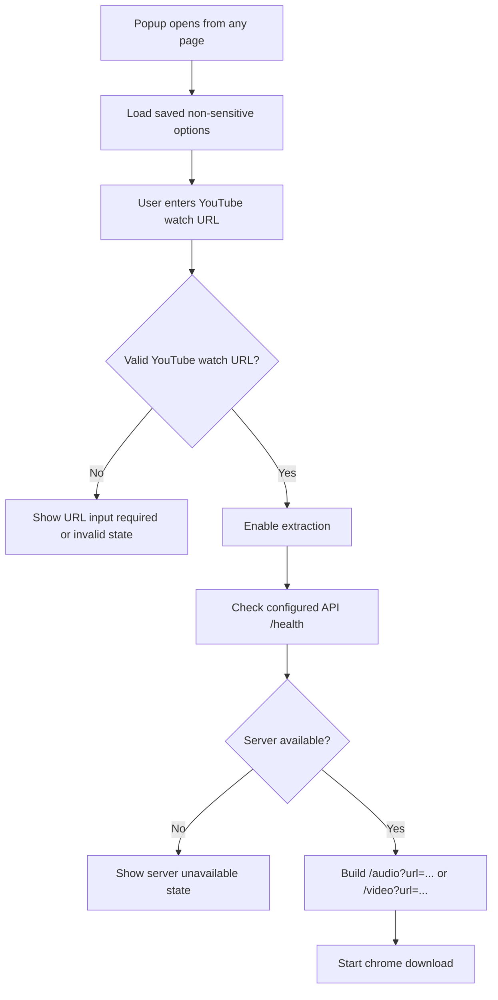

# feat: Switch extension popup to URL input extraction

## Summary

Chrome extension popup will move from active-tab YouTube detection to a URL-input extraction flow. Users can open the extension from any page, paste a YouTube watch URL, keep the optional filename behavior, and download through a Media Nest API URL selected by `WXT_MEDIA_NEST_API_BASE_URL`.

---

## Problem Frame

The current extension assumes the user is already on a supported YouTube watch page and treats "READY" as active-tab video detection. The desired UX is different: the extension should be a small extractor form that works from any browser page as long as the user has a URL.

---

## Requirements

- R1. Users can open the extension from any page and paste a YouTube watch URL manually.
- R2. The popup no longer requires the current active tab to be a YouTube watch page.
- R3. The filename input remains available and keeps its current optional behavior.
- R4. The API base URL is not user-editable and comes from `WXT_MEDIA_NEST_API_BASE_URL`; only `https://media-nest.codeliners.cc` and `http://127.0.0.1:3030` are expected.
- R5. Audio downloads use the API URL endpoint shape `GET /audio?url={SOURCE_URL}` with optional `filename` and `bitrate`.
- R6. Video downloads use the API URL endpoint shape `GET /video?url={SOURCE_URL}` with optional `filename` and `resolution`.
- R7. Popup status messaging explains source URL readiness and validation, not active-tab detection.
- R8. Existing build, unit, integration, manifest, and browser smoke coverage stays meaningful after the UX change.

---

## Scope Boundaries

- No Media Nest API server endpoint change. The server already supports URL-based `/audio?url=...` and `/video?url=...` requests.
- No automatic current-tab URL import in this iteration. Users explicitly paste or type the source URL.
- No download progress UI, queueing, history, account system, or Chrome Web Store release automation.
- The extension currently accepts YouTube watch URLs only, even though the API can accept broader `http` and `https` source URLs.
- No runtime API URL switching UI. Local development uses `WXT_MEDIA_NEST_API_BASE_URL=http://127.0.0.1:3030`; production uses `WXT_MEDIA_NEST_API_BASE_URL=https://media-nest.codeliners.cc`.

### Deferred to Follow-Up Work

- Optional "Use current tab URL" helper button: useful later, but outside the user's corrected UX for this pass.
- Optional source URL persistence: avoid storing arbitrary pasted URLs until product intent around convenience versus privacy is explicit.
- Narrower production CORS or extension origin allowlist: server-side operational hardening remains separate from this popup UX change.

---

## Context & Research

### Relevant Code and Patterns

- `apps/chrome-extension/src/app/popup-app.tsx` owns the popup form, fields, status card, and submit action wiring.
- `apps/chrome-extension/src/features/popup-download/popup-download-model.ts` owns option loading, readiness calculation, health check, download URL creation, and download state transitions.
- `apps/chrome-extension/src/services/media-nest/download-url.ts` currently builds path-based `/audio/:id` and `/video/:id` download URLs.
- `apps/chrome-extension/src/domain/download-options/download-options.ts` defines persisted popup options and API base URL normalization.
- `apps/chrome-extension/src/domain/popup-state/popup-state.ts` defines the status kinds and messages currently centered on active-tab scanning.
- `apps/chrome-extension/src/adapters/chrome/storage.ts` persists the keys in `STORAGE_KEYS`.
- `apps/chrome-extension/entrypoints/popup/dev-preview-chrome-api.ts` and `apps/chrome-extension/tests/browser/popup-smoke.mjs` currently fake active-tab state for the old popup contract.
- `docs/chrome-extension/current-implementation-prd.md` and `docs/chrome-extension/current-implementation-fsd.md` still describe the old active-tab MVP and need to be brought up to date.

### Institutional Learnings

- No repo-local `docs/solutions/` guidance was found for this feature area.
- No repo-local `AGENTS.md` file was found; the user-provided AGENTS instructions for this conversation apply. In particular, keep comments meaningful, stay with existing code patterns, and summarize referenced rule skills when done.

### External References

- External research is not needed for this plan. The implementation uses existing WXT, React, Chrome downloads, storage, and local API-client patterns already present in the repository.

---

## Key Technical Decisions

- Use explicit source URL input as the primary extraction target: this directly matches the corrected UX and removes the requirement to be on a YouTube detail page.
- Keep filename as a separate optional output filename field: this preserves the existing server contract and user request.
- Read the API base URL from `WXT_MEDIA_NEST_API_BASE_URL`: this removes the API URL setting from user-facing UI while keeping operating and local URLs explicit.
- Do not persist pasted source URLs by default: arbitrary URLs can be sensitive, and the user only asked for "URL만 있으면" extraction, not last-URL convenience.
- Continue using `chrome.downloads.download`: this matches the current extension behavior and keeps the browser smoke contract focused on the generated download URL.
- Remove active-tab readiness from the main model path: the extension can still keep Chrome APIs required for downloads/storage, but active-tab URL detection should no longer gate download eligibility.

---

## Open Questions

### Resolved During Planning

- Should the source URL be sent as full URL or reduced to a YouTube video ID? Full URL. The user corrected the UX to "url만 있으면 추출" and the API already has URL query endpoints.
- Should the filename input be repurposed into URL input? No. The user explicitly said the filename should remain.
- Which API should the extension target? `https://media-nest.codeliners.cc`.

### Deferred to Implementation

- Exact Korean status copy: final wording can be adjusted while implementing and visually checking the popup, as long as the meaning shifts away from active-tab detection.
- Exact layout spacing after removing the API field and adding the source URL field: settle during UI implementation and screenshot verification.

---

## High-Level Technical Design

> *This illustrates the intended approach and is directional guidance for review, not implementation specification. The implementing agent should treat it as context, not code to reproduce.*

---

## Implementation Units

### U1. Update Extension Option Contract

**Goal:** Introduce source URL as the user-provided extraction target and remove user-facing API base URL from the persisted option contract.

**Requirements:** R1, R3, R4

**Dependencies:** None

**Files:**
- Modify: `apps/chrome-extension/src/shared/constants.ts`
- Modify: `apps/chrome-extension/src/domain/download-options/download-options.ts`
- Modify: `apps/chrome-extension/src/adapters/chrome/storage.ts`
- Test: `apps/chrome-extension/tests/unit/download-url.test.ts`
- Test: `apps/chrome-extension/tests/integration/popup-download-model.test.ts`

**Approach:**
- Change the default Media Nest API base URL to `https://media-nest.codeliners.cc`.
- Add source URL to the in-memory popup option shape used by the model and UI.
- Keep `filename`, `mode`, `bitrate`, and `resolution` as user options.
- Remove `apiBaseUrl` from the user-editable storage contract. Existing saved `apiBaseUrl` values should be ignored so stale local settings cannot override the environment-selected API.
- Avoid persisting source URL unless implementation reveals the existing adapter shape makes that separation disproportionately invasive. If separation is invasive, keep the privacy decision explicit in code comments and tests.

**Execution note:** Implement this unit test-first around option merging and stale `apiBaseUrl` compatibility.

**Patterns to follow:**
- Existing `DEFAULT_DOWNLOAD_OPTIONS`, `STORAGE_KEYS`, and `mergeStoredDownloadOptions` pattern in `apps/chrome-extension/src/domain/download-options/download-options.ts`.
- Existing Chrome storage adapter wrapper in `apps/chrome-extension/src/adapters/chrome/storage.ts`.

**Test scenarios:**
- Happy path: saved mode and filename merge with the environment-selected API base URL.
- Edge case: saved `apiBaseUrl: http://127.0.0.1:3030` is ignored for download construction.
- Edge case: invalid saved mode still falls back to audio mode.
- Privacy behavior: source URL is not restored from storage if the final implementation keeps it session-only.

**Verification:**
- The model can load saved options without exposing or honoring user-editable API base URL.
- The environment-selected API base URL is available to health check and download URL builders from one shared constant.

### U2. Switch Download URL Builder to URL Query Endpoints

**Goal:** Build Media Nest download URLs using the source URL query endpoint instead of YouTube video ID path endpoints.

**Requirements:** R1, R5, R6

**Dependencies:** U1

**Files:**
- Modify: `apps/chrome-extension/src/services/media-nest/download-url.ts`
- Modify: `apps/chrome-extension/src/domain/youtube/youtube-url.ts`
- Test: `apps/chrome-extension/tests/unit/download-url.test.ts`

**Approach:**
- Replace the builder's required `videoId` input with a source URL input.
- Validate source URL as a YouTube watch URL with an 11-character `v` query value.
- Build `/audio?url={SOURCE_URL}` and `/video?url={SOURCE_URL}` using URLSearchParams so encoding is consistent.
- Preserve optional query behavior for `filename`, `bitrate`, and `resolution`.
- Keep or retire YouTube video ID utilities based on remaining test/dev-preview usage. If they are no longer imported after the change, remove them with their old tests.

**Execution note:** Start with failing unit tests for audio and video URL query construction before modifying the builder.

**Patterns to follow:**
- Existing `appendOptionalQuery` behavior in `apps/chrome-extension/src/services/media-nest/download-url.ts`.
- API server URL request tests in `apps/api/src/media/media-request.util.spec.ts` for broad `http/https` source URL acceptance.

**Test scenarios:**
- Happy path: audio mode with `https://www.youtube.com/watch?v=abc123_DEF0`, filename, and bitrate creates `audio?url=...&filename=...&bitrate=...`.
- Happy path: video mode with source URL and resolution creates `video?url=...&resolution=...`.
- Edge case: empty optional filename, bitrate, or resolution values are omitted.
- Error path: empty source URL throws a user-actionable validation error.
- Error path: non-YouTube, Shorts, `youtu.be`, unsupported protocols, and malformed strings are rejected.
- Error path: malformed strings such as `not-a-url` are rejected.

**Verification:**
- No download URL builder test expects `/audio/:id` or `/video/:id` for the extension path.
- URL encoding preserves the full pasted URL as a single `url` query value.

### U3. Rework Popup Model Readiness and Submit Flow

**Goal:** Make popup readiness depend on the entered source URL and fixed API server, not active-tab YouTube detection.

**Requirements:** R1, R2, R4, R7

**Dependencies:** U1, U2

**Files:**
- Modify: `apps/chrome-extension/src/features/popup-download/popup-download-model.ts`
- Modify: `apps/chrome-extension/src/domain/popup-state/popup-state.ts`
- Test: `apps/chrome-extension/tests/integration/popup-download-model.test.ts`

**Approach:**
- Remove the active-tab lookup from initialization as a download gate.
- Replace "checking tab", "unsupported page", and "missing API URL" state branches with source URL input states.
- Keep server health check at submit time, but target the API base URL selected by `WXT_MEDIA_NEST_API_BASE_URL`.
- Keep duplicate-submit protection and submitted-snapshot semantics so option changes during health check do not mutate the in-flight request.
- Ensure unsupported current browser pages do not affect `canDownload`.

**Execution note:** Add characterization tests for the old duplicate-submit/submitted-options behavior before rewiring submit flow, then update expected URLs.

**Patterns to follow:**
- Existing `renderReadyState` and `setSnapshot` state transition style in `apps/chrome-extension/src/features/popup-download/popup-download-model.ts`.
- Existing `PopupStatus` factory pattern in `apps/chrome-extension/src/domain/popup-state/popup-state.ts`.

**Test scenarios:**
- Happy path: model initializes on an arbitrary page with empty source URL and download disabled.
- Happy path: valid YouTube watch source URL enables download regardless of active tab URL.
- Happy path: submitting valid audio URL checks server once and starts one download.
- Happy path: video mode uses the submitted source URL and resolution even if options are edited while server check is pending.
- Edge case: duplicate submits during server check still produce one health check and one download.
- Error path: invalid source URL disables download and shows URL validation status.
- Error path: server unavailable keeps the form retryable and shows the failure state.
- Integration: fake storage containing old `apiBaseUrl` does not affect the environment-selected URL used by model behavior.

**Verification:**
- The model no longer needs a supported YouTube active tab to become downloadable.
- Status names and messages accurately describe source URL readiness.

### U4. Update Popup UI for URL Input and Fixed API

**Goal:** Replace active-tab-oriented UI and API server field with a URL-first extractor form while keeping filename and mode options.

**Requirements:** R1, R3, R4, R7

**Dependencies:** U1, U3

**Files:**
- Modify: `apps/chrome-extension/src/app/popup-app.tsx`
- Modify: `apps/chrome-extension/entrypoints/popup/style.css`
- Test: `apps/chrome-extension/tests/browser/popup-smoke.mjs`

**Approach:**
- Add a prominent YouTube watch URL input near the top of the form.
- Keep filename as its own optional field, likely labeled to clarify it is an output filename.
- Remove the API server address input from the popup.
- Change status labels and body copy so "READY" means the entered URL is ready, not a current tab was detected.
- Preserve the compact 360px popup layout and keep the primary button visible in the normal popup viewport.
- Keep comments focused on non-obvious state or layout decisions, not one-line JSX narration.

**Patterns to follow:**
- Existing controlled-input handler pattern in `apps/chrome-extension/src/app/popup-app.tsx`.
- Existing 16-bit visual styling and compact field layout in `apps/chrome-extension/entrypoints/popup/style.css`.

**Test scenarios:**
- Browser smoke: popup renders with source URL input, filename input, mode controls, adaptive option input, and no API server input.
- Browser smoke: entering a valid YouTube watch source URL enables the button.
- Browser smoke: arbitrary active tab URL still permits extraction when the source URL is a valid YouTube watch URL.
- Visual/layout: at 360px popup width, the primary action remains visible or comfortably reachable without broken overlap.

**Verification:**
- The screenshotable UI reads as "paste URL to extract" rather than "open on YouTube page to detect".
- The API server URL is not visible or editable in the popup.

### U5. Refresh Dev Preview and Browser Smoke Contracts

**Goal:** Keep local preview and automated browser smoke useful after active-tab detection is removed.

**Requirements:** R2, R4, R8

**Dependencies:** U1, U2, U3, U4

**Files:**
- Modify: `apps/chrome-extension/entrypoints/popup/dev-preview-chrome-api.ts`
- Modify: `apps/chrome-extension/tools/run-wxt-dev-ready.js`
- Modify: `apps/chrome-extension/tests/browser/popup-smoke.mjs`
- Modify: `apps/chrome-extension/tests/unit/dev-preview-chrome-api.test.ts`
- Modify: `apps/chrome-extension/tests/unit/run-wxt-dev-ready.test.mjs`

**Approach:**
- Reduce dev-preview fake Chrome API responsibility to storage/downloads behavior needed by the popup.
- Replace preview `tabUrl` query behavior with source URL prefill behavior if local preview still needs an auto-ready demo URL.
- Keep test-only API origin injection possible for smoke tests without reintroducing user-facing API configuration.
- Update smoke fake API assertions to expect `/audio?url=...` and `/video?url=...` requests.
- Revisit manifest expectations once activeTab is no longer required.

**Patterns to follow:**
- Existing preview URL creation and fake Chrome API setup in `apps/chrome-extension/tools/run-wxt-dev-ready.js`.
- Existing fake API server and fake downloads capture pattern in `apps/chrome-extension/tests/browser/popup-smoke.mjs`.

**Test scenarios:**
- Dev preview installs enough fake Chrome API for popup rendering without active-tab URL dependency.
- Preview URL opens the popup form without an active-tab URL dependency.
- Browser smoke verifies an unsupported/invalid source URL state without relying on unsupported current tab.
- Browser smoke verifies a successful audio download request against a fake API origin.
- Manifest test matches the final permission set after activeTab review.

**Verification:**
- `dev:smoke` and production `test:browser` remain aligned with the URL-input popup contract.
- Dev preview still gives a quick ready-state UI for local design inspection.

### U6. Update Product and Technical Documentation

**Goal:** Bring Chrome extension PRD/FSD and README descriptions in line with the new URL-input production API behavior.

**Requirements:** R1, R2, R3, R4, R5, R6, R7, R8

**Dependencies:** U1, U2, U3, U4, U5

**Files:**
- Modify: `docs/chrome-extension/current-implementation-prd.md`
- Modify: `docs/chrome-extension/current-implementation-fsd.md`
- Modify: `README.md`

**Approach:**
- Replace active-tab YouTube detection user stories with URL-input extraction stories.
- Mark API base URL input as removed and production URL as fixed.
- Keep filename, audio bitrate, and video resolution option descriptions.
- Update popup state documentation to source URL validation, server health, download started, and failure states.
- Update dev preview and smoke instructions so they no longer imply that the main UX requires a YouTube tab.

**Patterns to follow:**
- Existing PRD/FSD structure and concise Korean product wording in `docs/chrome-extension`.
- README's current Chrome Extension section organization.

**Test scenarios:**
- Test expectation: none -- documentation-only unit. Verification is consistency against implemented behavior and existing API docs.

**Verification:**
- A reader can understand that the extension works from any page using a pasted URL.
- Docs no longer describe active-tab detection as the primary MVP behavior.

---

## System-Wide Impact

- **Interaction graph:** Popup UI, popup model, storage adapter, download URL builder, dev preview, and browser smoke tests change together. API controllers and media download service stay unchanged.
- **Error propagation:** Source URL validation errors should remain client-side status states. Server health and download failures should keep the existing retryable failure behavior.
- **State lifecycle risks:** Removing persisted API URL avoids stale local development URLs overriding production. API URL selection should come from `WXT_MEDIA_NEST_API_BASE_URL`, and source URL should not be persisted unless explicitly chosen.
- **API surface parity:** The extension switches to the API's URL query contract already documented for both audio and video. API server behavior should remain backward compatible for direct `/audio/:id` and `/video/:id` calls.
- **Integration coverage:** Browser smoke must prove that arbitrary active tabs no longer block download and that the generated download URL hits the fake API's URL endpoint.
- **Unchanged invariants:** Filename, bitrate, resolution, mode selection, server health check before download, and `chrome.downloads.download` remain part of the extension behavior.

---

## Risks & Dependencies

| Risk | Mitigation |
|------|------------|
| The popup accidentally stores arbitrary source URLs in Chrome local storage | Keep source URL session-only in the option contract and test old/new storage behavior |
| Tests need a local API URL while production UI must not expose API settings | Use `WXT_MEDIA_NEST_API_BASE_URL` for build/dev configuration, not user-facing UI |
| Removing activeTab may break assumptions in manifest or smoke setup | Update manifest verification and load-unpacked smoke together with model changes |
| Production API CORS or download behavior differs from local fake API | Keep server health and fake API browser smoke, and verify against production only when explicitly approved or in a controlled manual check |
| UI copy still implies current-tab detection | Update status messages, PRD/FSD, README, and final screenshot verification together |

---

## Documentation / Operational Notes

- The extension chooses its API URL through `WXT_MEDIA_NEST_API_BASE_URL`; production uses `https://media-nest.codeliners.cc`, local dev uses `http://127.0.0.1:3030`.
- Local development uses environment configuration and test harness routing rather than a popup API URL input.
- If production hardening later restricts CORS to extension origins, that work should be planned separately because it touches API deployment configuration and extension ID management.

---

## Sources & References

- Related product doc: `docs/chrome-extension/current-implementation-prd.md`
- Related technical doc: `docs/chrome-extension/current-implementation-fsd.md`
- API technical doc: `docs/api/current-implementation-fsd.md`
- Popup app: `apps/chrome-extension/src/app/popup-app.tsx`
- Popup model: `apps/chrome-extension/src/features/popup-download/popup-download-model.ts`
- Download URL builder: `apps/chrome-extension/src/services/media-nest/download-url.ts`
- Download options: `apps/chrome-extension/src/domain/download-options/download-options.ts`
- Popup status: `apps/chrome-extension/src/domain/popup-state/popup-state.ts`
- Browser smoke: `apps/chrome-extension/tests/browser/popup-smoke.mjs`
